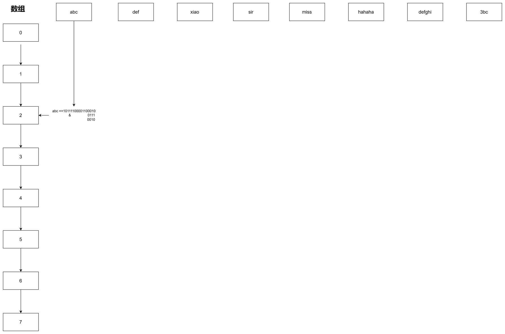

## HashMap


- 散列表实现

假如我们不使用HashMap,自己实现一个散列的内容,可能的代码类似如下

```java
List<String> data = new ArrayList<>();
        data.add("abc");
        data.add("def");
        data.add("xiao");
        data.add("sir");
        data.add("miss");
        data.add("haha");
        data.add("defgi");
        data.add("3bc");
        int size = data.size();
        String[] tab=new String[size];

        for (int i = 0; i < size; i++) {
             String d=data.get(i);
             System.out.println(NumberUtil.getBinaryStr(d.hashCode()));
             int idx = d.hashCode()&(size-1);
             System.out.println("key:"+idx+"=valus:"+d);
             if(null == tab[idx]){
                 tab[idx] =d;
             }else {
                 tab[idx] = tab[idx] +"->"+ d;
             }
        }
        System.out.println(JSON.toJSONString(tab));
====>>输出结果：
10111100001100010
key:2=valus:abc
11000010000000101
key:5=valus:def
1110000010001011011111
key:7=valus:xiao
11011110011011100
key:4=valus:sir
1100110010010011111100
key:4=valus:miss
1100001011111110110010
key:2=valus:haha
101101100001010001110100111
key:7=valus:defgi
1100101110110100
key:4=valus:3bc
[null,null,"abc->haha",null,"sir->miss->3bc","def",null,"xiao->defgi"]
```

通过输出的结果中可以思考以下几个问题？

1. 数组越小碰撞的越大，数组越大碰撞的越小，时间与空间如何取舍。
2. 目前存放7个元素，已经有两个位置都存放了2个字符串，那么链表越来越长怎么优化。
3. 随着元素的不断添加，数组长度不足扩容时，怎么把原有的元素，拆分到新的位置上去
- 扰动函数
  
java8中hashMap的扰动函数hash计算如下

```java
static final int hash(Object key) {
        int h;
        return (key == null) ? 0 : (h = key.hashCode()) ^ (h >>> 16);
    }
abc的hashcode值为
000000000000000010111100001100010
右移16位
000000000000000000000000000000001
自身的高16位与自身的低16位进行异或运算（相等为0不等为1）
000000000000000010111100001100011
```

使用扰动函数的情况下,数据分布更均匀

- 初始化容量

初始化数组的长度必须是2的最小次幂

- 负载因子

一个合理的大小下进行扩容，默认值0.75就是说当阈值容量占了3/4时赶紧扩容，减少Hash碰撞。

- 扩容

扩容就考虑到是否要重新进行hash计算数据存放的索引, 针对java8而言不需要重新计算下标。那么这个是怎么做到的呢？

验证：

```java
List<String> list = new ArrayList<>();
        list.add("jlkk");
        list.add("lopi");
        list.add("jmdw");
        list.add("e4we");
        list.add("io98");
        list.add("nmhg");
        list.add("vfg6");
        list.add("gfrt");
        list.add("alpo");
        list.add("vfbh");
        list.add("bnhj");
        list.add("zuio");
        list.add("iu8e");
        list.add("yhjk");
        list.add("plop");
        list.add("dd0p");
        int size = list.size();

        for (int i = 0; i < size; i++) {
            String d = list.get(i);
            int hash = d.hashCode() & (d.hashCode() >>> 16);
            System.out.println("字符串：" + d + " \tIdx(16)：" + Integer.toBinaryString((16 - 1) & hash) +  "\tIdx(16)"+Integer.toBinaryString((32 - 1) & hash));
        }

===>输出结果
字符串：jlkk 	Idx(16)：0	Idx(32)0
字符串：lopi 	Idx(16)：0	Idx(32)10000
字符串：jmdw 	Idx(16)：0	Idx(32)10000
字符串：e4we 	Idx(16)：1100	Idx(32)1100
字符串：io98 	Idx(16)：1	Idx(32)1
字符串：nmhg 	Idx(16)：10	Idx(32)10010
字符串：vfg6 	Idx(16)：111	Idx(32)10111
字符串：gfrt 	Idx(16)：0	Idx(32)0
字符串：alpo 	Idx(16)：1000	Idx(32)1000
字符串：vfbh 	Idx(16)：110	Idx(32)10110
字符串：bnhj 	Idx(16)：1110	Idx(32)1110
字符串：zuio 	Idx(16)：1	Idx(32)1
字符串：iu8e 	Idx(16)：1	Idx(32)10001
字符串：yhjk 	Idx(16)：0	Idx(32)10000
字符串：plop 	Idx(16)：100	Idx(32)10100
字符串：dd0p 	Idx(16)：0	Idx(32)0
```

通过输出的结论可以等出一个公式,如果 oldCap&newCap=0 下标不变 不为0 则增加到需要扩容的位数(ex: 16)。扩容大小刚好为2的幂次方。

每次容量满足3/4进行扩容的原因 : table.length-(table.length>>2)

- 链表树化

table.length≥64 && 链表长度≥8的时候

- 红黑树

需要经历左旋 右旋转 染色

## 问题?
为什么 HashMap 的数组长度要取 2 的整数幂?
因为这样（数组长度 - 1）正好相当于一个 “低位掩码”。与 操作的结果就是散列值的高位全部归零，只保留低位值，用来做数组下标访问。

扰动函数右移 16 位，正好是 32bit 的一半，自己的高半区和低半区做异或，就是为了混合原始哈希码的高位和低位，以此来加大低位的随机性。而且混合后的低位掺杂了高位的部分特征，这样高位的信息也被变相保留下来。


*其它的hash函数*

## 解决hash冲突有哪些方法？
- 链地址法
  冲突的位置增加一个链表,用链表存放冲突的元素
- 开放地址法
  从冲突的位置再接着往下找,给冲突元素找个空位


### SynchorizedMap hashmap hashtable之间的区别？

- SynchorizedMap 是线程安全的,使用了synchorized进行加锁处理,put,get操作都能保证数据是线程安全
- hashtable Vs HashMap
hashtable允许key,value为null.HashMap则不可以
hashtable是线程安全,hashmap不是。
迭代器实现方式不一样 hashMap是fail-fast。hashtable是fail-safe。  
  
#### 为什么hashtable不允许为空？
- 源码设计上如果传入为null 会报空指针异常。

### 问题
- jdk1.7会出现什么问题？
扩容时候的插入过程,注意一点使用的是头插入方式


> 则可能会出现线程一已经修改完成7->3 线程二又重复执行3—>7造成环形链表。

执行get(key),key本身又不存在就会出现死循环。
数据丢失

- jdk1.8会出现什么问题？

并发put的时候,存在数据覆盖的情况。

### 1.8相比1.7优化策略在哪儿？
使用红黑树+尾插法优化掉存储结构

## ConcurrentHashMap

1.7使用segment分段锁  16个桶
1.8使用cas+synchronized

## 快速失败跟安全失败
快速失败是java集合的一种错误机制
集合执行遍历元素的时候,线程A在遍历对象 线程B对集合内容进行了修改,就会抛出异常。

安全失败
基于拷贝的集合进行安全遍历,所以不会触发异常。但并发修改后,不能读取到最新的数据


