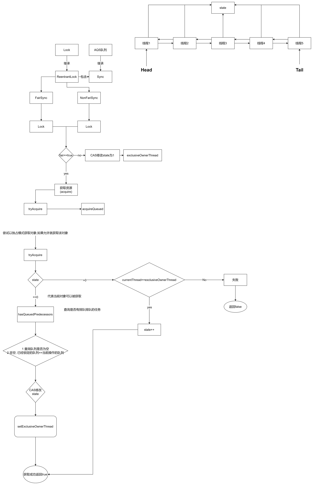
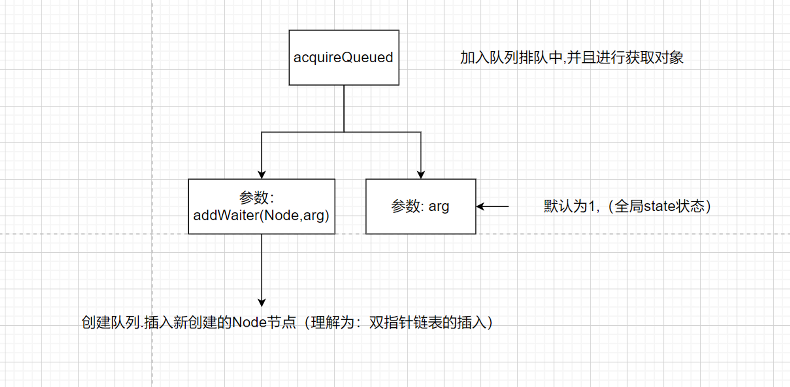
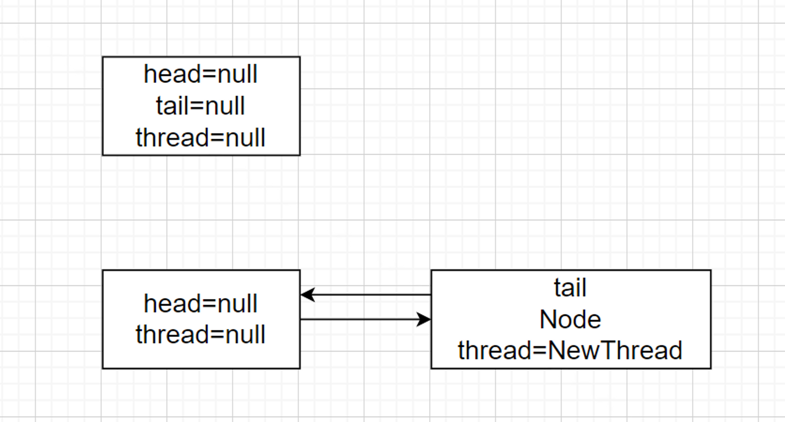
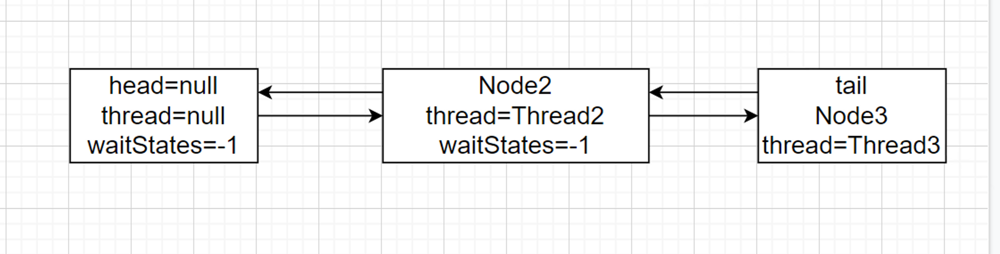

聊聊认识的锁?


## JUC框架锁

## synchorized
> 主要就是实现原子性操作和解决共享变量的内存可见性问题。

> 从内存来说，加锁的过程会清除工作内存中的共享变量，再从主内存读取，而释放锁的过程则是将工作内存中的共享变量写回主内存。

### 使用

第一种 代码块
```java
public class TestMain {
    Object object = new Object();

    public void synchronizedParams() {
        synchronized (object) {


        }
    }
}
```
> synchronized(object) 在对某个对象上执行加锁时，会尝试在该对象的监视器上进行加锁操作，只有成功获取锁之后，线程才会继续往下执行。线程获取到了监视器锁后，将继续执行 synchronized 代码块中的代码，如果代码块执行完成，或者抛出了异常，线程将会自动对该对象上的监视器执行解锁操作。

第二种 方法
```java
public class TestMain {

    Object object = new Object();

    public synchronized void method() {
        //
    }
}
```
> 作用于方法，称为同步方法。同步方法被调用时，会自动执行加锁操作，只有加锁成功，方法体才会得到执行。如果被 synchronized 修饰的方法是实例方法，那么**这个实例的监视器**会被锁定。如果是 static 方法，线程会锁住相应的 **Class 对象的监视器**。方法体执行完成或者异常退出后，会自动执行解锁操作。

DDL（单例模式）

```java
public class Singleton {
    private static volatile Singleton singleton;

    private Singleton(){

    }

    public Singleton getInstance(){
        if(singleton==null){
            synchronized (Singleton.class){
                if(singleton==null){
                    singleton=new Singleton();
                }
            }
        }
        return  singleton;
    }
}
```

> 如果不加volatile,会有问题吗？为什么

第一个线程在初始化初始化对象，设置 instance 指向内存地址时。第二个线程进入时，有指令重排。在判断 if (instance == null) 时就会有出错的可能，因为这会可能 instance 可能还没有初始化成功。

### 锁升级
无锁-偏向锁-轻量级锁-重量级锁
- 无锁 000
- 偏向锁 101
- 轻量级锁 10
- 重量级锁 11

锁修改的是对象头的markWord的锁标识位,以及设置threadId。

- 偏向锁
  无实际竞争，且将来只有第一个申请锁的线程会使用锁。
> 修改对象头的锁状态,并设置线程ID,如果同一个线程有多次调用,则计数+1,这也是可重入的机制.

什么时候升级?
线程2抢占资源的时候,如果发现当前资源依然被线程一持有,锁就会升级会轻量级锁


- 轻量级锁 无实际竞争，多个线程交替使用锁；允许短时间的锁竞争。

什么时候升级?
参考如上面一个过程,这一点很好理解。假如只有一个卫生间,但是有两个人要去抢占,一个人抢到了,第二个就会不停的去问,有没有空间。经过多次尝试都失败后。
第一个人干脆就把大门锁上,根本不会让第二个人来问。

- 重量级锁 有实际竞争，且锁竞争时间长。


> 控制并发的时候,大部分都会选择使用Synchorized,因为在1.8之后的版本升级,锁的膨胀对性能带来的损耗已经是微乎其微(追求极致的性能除外)

## volatile

- 解决什么问题？

1 volatile，会控制被修饰的变量在内存操作上主动把值刷新到主内存，JMM 会把该线程对应的CPU内存设置过期，从主内存中读取最新值。

2 volatile 如何防止指令重排也是内存屏障，volatile 的内存屏故障是在读写操作的前后各添加一个 StoreStore屏障，也就是四个位置，来保证重排序时不能把内存屏障后面的指令重排序到内存屏障之前的位置。

3 volatile 并不能解决原子性，如果需要解决原子性问题，需要使用 synchronzied 或者 lock。


## ReentrantLock
流程梳理图如下


根据流程图如何从CLH队列中选择合适的排队线程,以及工作原理呢
acquireQueued()



addWaiter(Node,arg)



第一种情况：第一次获取对象锁失败,此时还被其他线程占用

if (p == head && tryAcquire(arg)) {//省略}

此时p==head 是True，执行获取tryAcquire(1) 的时候,能够成功获得对象
```java
public abstract class AbstractQueuedSynchronizer
        extends AbstractOwnableSynchronizer
        implements java.io.Serializable {
    //省略
    final boolean acquireQueued(final Node node, int arg) {
        boolean failed = true;
        try {
            boolean interrupted = false;
            for (; ; ) {
                final Node p = node.predecessor();
                //第一种情况
                if (p == head && tryAcquire(arg)) {
                    setHead(node);
                    p.next = null; // help GC
                    failed = false;
                    return interrupted;
                }
                
                if (shouldParkAfterFailedAcquire(p, node) &&
                        parkAndCheckInterrupt())
                    interrupted = true;
            }
        } finally {
            if (failed)
                cancelAcquire(node);
        }
    }
}
```
第二种情况：   新加入一个Node排队中
```shell
if (shouldParkAfterFailedAcquire(p, node) && parkAndCheckInterrupt()){//省略}
```



`shouldParkAfterFailedAcquire`

当前的节点获取资源是需要由前置节点唤醒, 第一次循环进入`shouldParkAfterFailedAcquire`是返回的false，此时的waitStatus是默认值, 将它设置为`Node.*SIGNAL。` 第二次进入循环 if(ws==Node.SIGNAL) 为true 直接返回true*

```shell
private static boolean shouldParkAfterFailedAcquire(Node pred, Node node) {
        int ws = pred.waitStatus;
        if (ws == Node.SIGNAL)
            /*
             * This node has already set status asking a release
             * to signal it, so it can safely park.
             */
            return true;
        if (ws > 0) {
            /*
             * Predecessor was cancelled. Skip over predecessors and
             * indicate retry.
             */
            do {
                node.prev = pred = pred.prev;
            } while (pred.waitStatus > 0);
            pred.next = node;
        } else {
            /*
             * waitStatus must be 0 or PROPAGATE.  Indicate that we
             * need a signal, but don't park yet.  Caller will need to
             * retry to make sure it cannot acquire before parking.
             */
            compareAndSetWaitStatus(pred, ws, Node.SIGNAL);
        }
        return false;
    }
```

parkAndCheckInterrupt()

```shell
private final boolean parkAndCheckInterrupt() {
			//挂起当前的线程,等待被前置节点唤醒
        LockSupport.park(this);
        return Thread.interrupted();
    }
```

### 解锁操作

```java
public final boolean release(int arg) {
        if (tryRelease(arg)) {
            Node h = head;
            if (h != null && h.waitStatus != 0)
                unparkSuccessor(h);
            return true;
        }
        return false;
    }
```

`tryRelease: AQS队列中的state,exclusiveOwnerThread 设置为空`

`head的waitStatus不为空,则代表当前队列中存在线程、需要被唤醒获取资源。`

**unparkSuccessor(h)**

```java
private void unparkSuccessor(Node node) {
        /*
         * If status is negative (i.e., possibly needing signal) try
         * to clear in anticipation of signalling.  It is OK if this
         * fails or if status is changed by waiting thread.
         */
        int ws = node.waitStatus;
        if (ws < 0)
            compareAndSetWaitStatus(node, ws, 0);
				//从尾节点忘前找,找到一个合适的头唤醒
        Node s = node.next;
        if (s == null || s.waitStatus > 0) {
            s = null;
            for (Node t = tail; t != null && t != node; t = t.prev)
                if (t.waitStatus <= 0)
                    s = t;
        }
        if (s != null)
					  //唤醒之前park的线程,继续往后执行
            LockSupport.unpark(s.thread);
    }
```

总结：

1. 锁状态。我们要知道锁是不是被别的线程占有了，这个就是 state 的作用，它为 0 的时候代表没有线程占有锁，可以去争抢这个锁，用 CAS 将 state 设为 1，如果 CAS 成功，说明抢到了锁，这样其他线程就抢不到了，如果锁重入的话，state进行 +1 就可以，解锁就是减 1，直到 state 又变为 0，代表释放锁，所以 lock() 和 unlock() 必须要配对啊。然后唤醒等待队列中的第一个线程，让其来占有锁。
2. 线程的阻塞和解除阻塞。AQS 中采用了 LockSupport.park(thread) 来挂起线程，用 unpark 来唤醒线程。
3. 阻塞队列。因为争抢锁的线程可能很多，但是只能有一个线程拿到锁，其他的线程都必须等待，这个时候就需要一个 queue 来管理这些线程，AQS 用的是一个 FIFO 的队列，就是一个链表，每个 node 都持有后继节点的引用。

### 公平锁与非公平锁的区别

- 非公平锁会在lock后,首先就调用cas进行一次抢锁,如果刚好锁没有被占用,直接获取锁返回
- 非公平锁在 CAS 失败后，和公平锁一样都会进入到 tryAcquire 方法，在 tryAcquire 方法中，如果发现锁这个时候被释放了（state == 0），非公平锁会直接 CAS 抢锁，但是公平锁会判断等待队列是否有线程处于等待状态，如果有则不去抢锁，乖乖排到后面

公平锁和非公平锁就这两点区别，如果这两次 CAS 都不成功，那么后面非公平锁和公平锁是一样的，都要进入到阻塞队列等待唤醒。
相对来说，非公平锁会有更好的性能，因为它的吞吐量比较大。当然，非公平锁让获取锁的时间变得更加不确定，可能会导致在阻塞队列中的线程长期处于饥饿状态


- 分布式锁?

> 详见分布式那一块章节


## 底层概念
- 乐观锁
> 在读多写少的场景中使用,并发性低的场景中使用,默认是不会上锁,一般的实现是基于CAS
- 悲观锁
> 在读少写多的场景中使用,并发性高的场景中使用,每次写数据的时候都会上锁,ReentrantLock跟Synchorized都是这种实现之一


