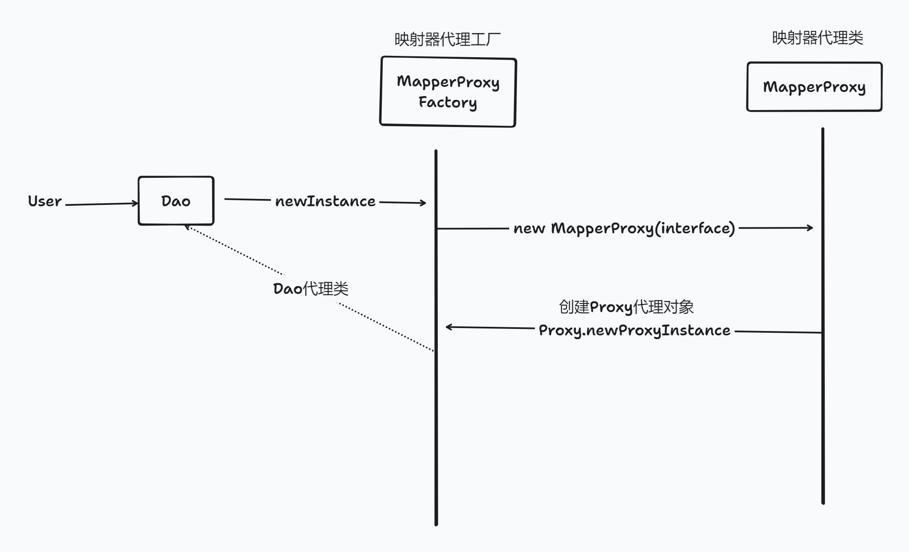

在业务开发中,我们只需要操作Dao,就能完成对数据库的CRUD。似乎里面有什么魔法,框架是如何知道我们操作的表,返回的参数类型呢。

此时会涉及到第一个核心技术,动态代理。

MyBatis 动态代理的作用主要是用于创建接口的实现对象，在运行时动态地将接口方法的调用重定向到指定的处理器上。

控制目标对象的访问：通过代理模式，可以对目标对象的方法调用进行控制，比如权限验证、日志记录等。
- 增强功能：代理可以在不修改原有代码的基础上，为目标对象的方法添加额外的功能，例如事务管理、性能监控等。
- 解耦：使用动态代理可以减少代码间的直接依赖，提高系统的可维护性和扩展性。
- 灵活性：动态代理在运行时生成代理对象，可以根据需要灵活地选择不同的处理方法，而不需要修改每个代理类的方法。
- 简化配置：MyBatis 通过动态代理机制，可以自动生成接口的实现类，这样用户只需要定义接口和映射文件，无需编写具体的实现类。
- 提高效率：由于代理对象的生成是在运行时完成的，因此可以节省编译时间和资源。
- 便于维护：当接口方法需要变更时，只需修改少量的代理处理逻辑，而不需要改动每个实现类。
- 支持多种代理方式：MyBatis 支持 JDK 动态代理和 CGLib 动态代理两种方式，用户可以根据需要选择合适的代理方式。

## Mybatis的动态代理简易类图实现



## 注册机模式
使用Map存储MapperProxyFactory, 使用一个总类管理所有注册的Mapper。
```java
public class MapperRegistry {
    private final Map<Class<?>, MapperProxyFactory<?>> knownMappers = new ConcurrentHashMap<>();

    public <T> T getMapper(Class<T> type, SqlSession sqlSession) {
        final MapperProxyFactory<T> mapperProxyFactory = (MapperProxyFactory<T>) knownMappers.get(type);
        if (mapperProxyFactory == null) {
            throw new BindingException("Type " + type + " is not known to the MapperRegistry.");
        }
        try {
            return mapperProxyFactory.newInstance(sqlSession);
        } catch (Exception e) {
            throw new BindingException("Error getting mapper instance. Cause: " + e, e);
        }
    }
}
```

