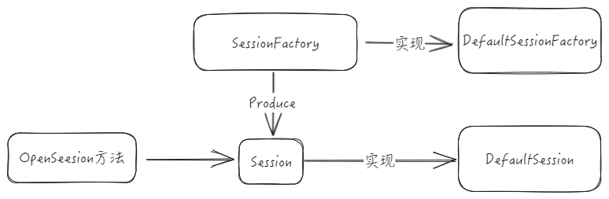

# 看源码不止看源码
> Java世界的ORM框架,Mybatis非常流行,碾压JPA,hibernate等框架。可能有意无意,我们就会看源码。

Mybatis的源码可以给人一些惊喜,如果自己看不懂、网上解析的教程也很多。但是有个问题是我们看完后,能有什么用呢。于是我在看完v3.5.0版本后,重新回顾与反思。

列出以下几点

## 设计模式
### 工厂模式
DataSourceFactory创建DataSource连接使用
### 策略模式
TypeHandler类型处理,适配多种Java类型,例如IntegerTypeHandler,DateTypeHandler等
### 模版模式

### 代理模式
mybatis对于log,datasource处理等

## 注册机模式
> 将需要用的配置信息,全都封装到一个注册类里。大量使用Hash表数据结构,存储业务需要的处理器,为了后续处理。

例如:TypeHandlerRegistry
```java
public final class TypeHandlerRegistry {
  private final Map<JdbcType, TypeHandler<?>> jdbcTypeHandlerMap = new EnumMap<>(JdbcType.class);
  private final Map<Type, Map<JdbcType, TypeHandler<?>>> typeHandlerMap = new ConcurrentHashMap<>();
  private final TypeHandler<Object> unknownTypeHandler;
  private final Map<Class<?>, TypeHandler<?>> allTypeHandlersMap = new HashMap<>();
  private static final Map<JdbcType, TypeHandler<?>> NULL_TYPE_HANDLER_MAP = Collections.emptyMap();
  //...
}
```

## 架构设计能力

### 设计模式的使用
例如会话管理
Mybatis的Session,是由SessionFactory,通过工厂模式生产Session。


### 模块化
Mybatis的功能模块化比较完整,这也就是我们常说的高内聚,低耦合的最佳实践。换言之,每一个模块边界拆分得比较详细。

### 动态代理
mybatis的动态代理,插件机制实现原理。


