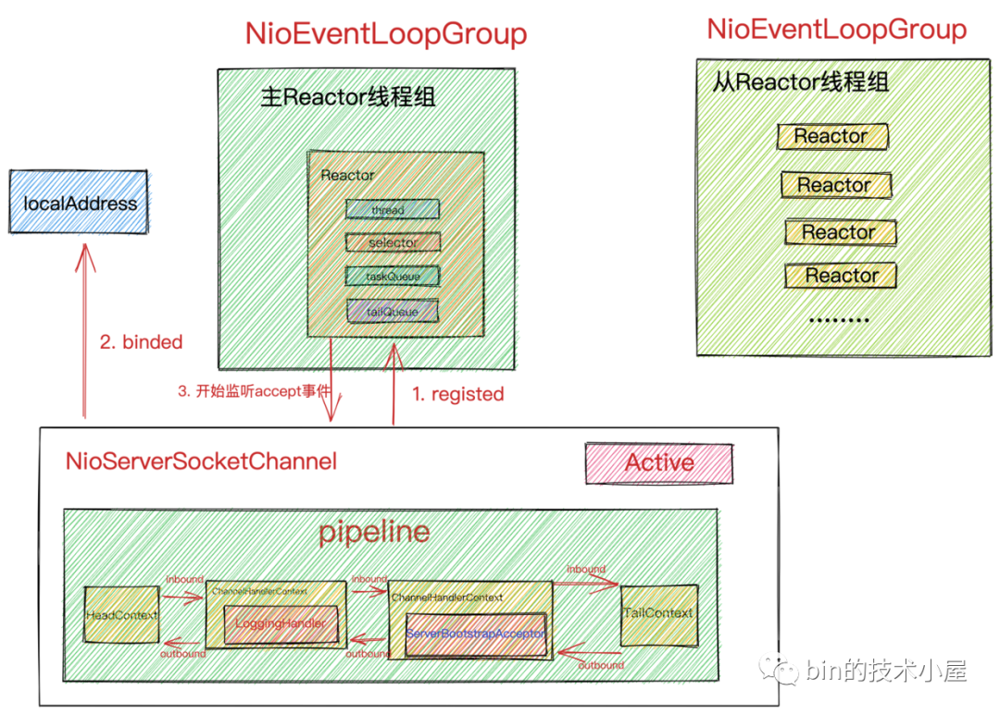

数据来源: bin的技术小屋
## Netty启动流程
```shell
  //省略
 Channel channel = null;
        try {
            sync = serverBootstrap.bind().sync();
            channel = sync.channel();
        } catch (InterruptedException e) {
            e.printStackTrace();
}
```
执行dobind函数,这个函数主要做的事情就是首先创建NioServerSocketChannel，并对NioServerSocketChannel进行初始化，最后将NioServerSocketChannel注册到Main Reactor
```shell
 private ChannelFuture doBind(final SocketAddress localAddress) {
        final ChannelFuture regFuture = initAndRegister();
        final Channel channel = regFuture.channel();
        if (regFuture.cause() != null) {
            return regFuture;
        }
        if (regFuture.isDone()) {
            // 成功处理逻辑
            ChannelPromise promise = channel.newPromise();
            doBind0(regFuture, channel, localAddress, promise);
            return promise;
        } else {
           //失败处理逻辑
        }
    }
    //initAndRegister 初始化并且注册
    final ChannelFuture initAndRegister() {
        Channel channel = null;
        try {
            //通过反射创建NioServerSocketChannle
            channel = channelFactory.newChannel();
            //初始化
            init(channel);
        } catch (Throwable t) {
            //异常处理
        }
       //向MainReactor注册ServerSocketChannel
        ChannelFuture regFuture = config().group().register(channel);
        if (regFuture.cause() != null) {
            if (channel.isRegistered()) {
                channel.close();
            } else {
                channel.unsafe().closeForcibly();
            }
        }
    }
```
register注册,next()函数也就是上个章节提到的route-robin选择Reactor
```shell
 @Override
    public ChannelFuture register(Channel channel) {
        return next().register(channel);
    }
```

从ReactorGroup中选取一个Reactor进行注册绑定。之后Channel生命周期内的所有IO 事件都由这个Reactor 负责处理，如 accept、connect、read、write等 IO 事件。
一个channel只能绑定到一个Reactor上，一个Reactor负责监听多个channel

执行真正的register操作
```shell
   @Override
    public ChannelFuture register(final ChannelPromise promise) {
        ObjectUtil.checkNotNull(promise, "promise");
        promise.channel().unsafe().register(this, promise);
        return promise;
    }
    
     @Override
        public final void register(EventLoop eventLoop, final ChannelPromise promise) {
            ObjectUtil.checkNotNull(eventLoop, "eventLoop");
            if (isRegistered()) {
          
                return;
            }
            if (!isCompatible(eventLoop)) {
          
                return;
            }

            AbstractChannel.this.eventLoop = eventLoop;

            if (eventLoop.inEventLoop()) {
                register0(promise);
            } else {
                try {
                    eventLoop.execute(new Runnable() {
                        @Override
                        public void run() {
                            register0(promise);
                        }
                    });
                } catch (Throwable t) {
                    logger.warn(
                            "Force-closing a channel whose registration task was not accepted by an event loop: {}",
                            AbstractChannel.this, t);
                    closeForcibly();
                    closeFuture.setClosed();
                    safeSetFailure(promise, t);
                }
            }
        }
```
- 首先检查NioServerSocketChannel是否已经完成注册。如果以完成注册，则直接设置代表注册操作结果的ChannelPromise为fail状态。
- 通过isCompatible方法验证Reactor模型EventLoop是否与Channel的类型匹配。NioEventLoop对应于NioServerSocketChannel。
- isCompatible方法目的就是需要保证Reactor和Channel使用的是同一种IO模型。
- 在Channel中保存其绑定的Reactor实例。
- 执行Channel向Reactor注册的动作必须要确保是在Reactor线程中执行。
- 如果当前线程是Reactor线程则直接执行注册动作register0
- 如果当前线程不是Reactor线程，则需要将注册动作register0封装成异步任务，存放在Reactor中的taskQueue中，等待Reactor线程执行。
- 当前执行线程并不是Reactor线程，而是用户程序的启动线程Main线程。

最终启动流程图如下所示



