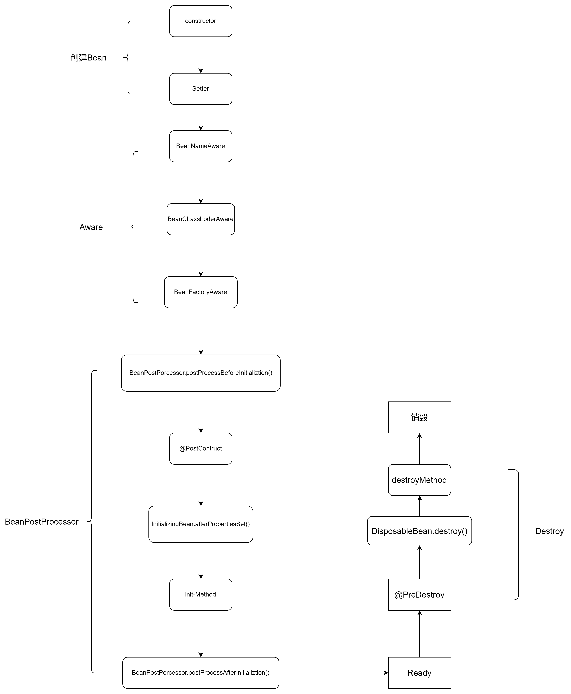

感知容器
经过对Spring容器内部的管理代码梳理,明白spring是如何在创建Bean以及Bean的完整生命周期。但是之前提到的扩展性没有详细说明

应用上下文(ApplicationContext)不能直接获取，因为用户层没法去接触应用上下文。
面向于用户的 ClassPathXmlApplicationContext 从功能角度而言不能添加感知接口，所以新建一个后置器去包装感知方法，通过抽象实现 AbstractApplicationContext 中进入 refresh 核心方法中添加后置处理器时AbstractApplicationContext 本身存入后置处理器中.

