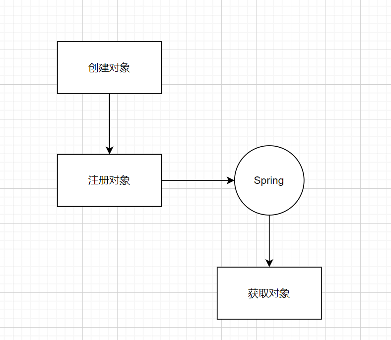
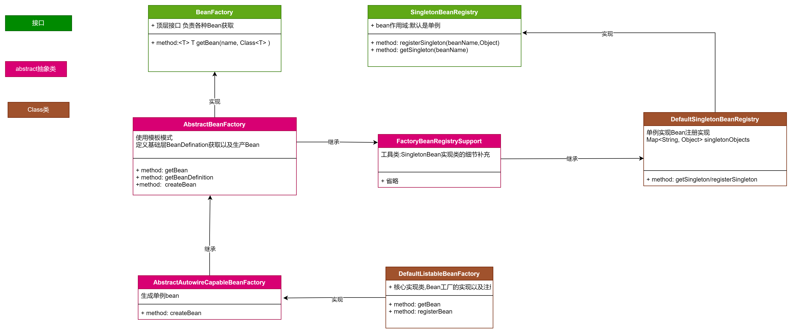

# what

Spring IOC（Inversion of Control，控制反转）是Spring框架的一个核心特性。它是一种设计原则，通过该原则可以实现解耦和提高代码的可维护性。 Spring
IOC的核心思想是通过反转对象的创建和依赖关系的管理，将对象的创建和依赖关系的处理从应用程序代码中解耦出来，由Spring容器来负责管理。应用程序只需要声明需要依赖的对象，而不需要关心对象的创建和管理细节。

具体来说，应用程序通过配置文件或注解告诉Spring容器需要创建哪些对象，以及它们之间的依赖关系。Spring容器根据这些配置信息，在应用程序运行时动态地创建和管理对象，并自动解决对象之间的依赖关系。

通过使用Spring IOC，可以实现以下好处：

解耦：应用程序的各个模块之间通过接口进行交互，不再直接依赖具体的实现类，降低模块之间的耦合度。 可维护性：对象的创建和依赖关系的管理集中在Spring容器中，使得代码更容易理解、测试和维护。
可扩展性：通过配置文件或注解，可以方便地添加、修改或替换对象的实现，而不需要修改应用程序的源代码。

# spring5.x

spring体系发展壮大,使用@Autowired, @Resource等注解,引入bean对象,并使用它。

# 理解IOC

*一次声明,多次使用* (默认是单例)

举一个场景,基于MVC架构,controller调用service,service调用dao。

```java
import javax.annotation.Resource;

public class UserController {
    @Resource
    UserService userService;

    public void login() {
        userService.login();
    }
}

public class UserService {
    @Resource
    UserDao userDao;

    public void login() {
        userDao.login();
    }
}

//DAO 操作SQL
```

如果不使用@Resource,我们可能得这么干。每次使用需要new 对象,如果这么干,那么我们gc回收的频率得多快,影响使用。

```java
public class UserController {
    public void login() {
        UserService userService = new UserService();
        userService.login();
    }
}

public class UserService {

    public void login() {
        UserDao userService = new UserDao();
        userDao.login();
    }
}
```

那么有人说我们可以使用cache,使用单例就能保证项目中只存在一份instance,那为啥这种方案也不行?

假如新增一个简单需求,统计每一个接口的耗时统计? 那么我们该如何coding?
```java
public class UserController {
    public void login() {
        long start = System.currentTimeMillis();
        UserService userService = new UserService();
        userService.login();
        long end = System.currentTimeMillis();
        System.out.println("time is " + (end - start));
    }
}
```
那统计一下每个dao,操作SQL的执行时间呢。我们得硬编码,去做各种业务逻辑。代码冗余度会很高,在扩展性和维护性会很低,因此学习IOC的思想,看看Spring的优秀设计,对于做项目是非常重要的一件事。

# 学习IOC



## 基础定义
BeanDefinition是Spring框架中的一个概念，它用于描述Spring容器中的Bean对象的定义信息。每个Bean都需要一个BeanDefinition来描述它的类型、属性、依赖关系等信息。
BeanDefinition包含了以下属性：
- Bean的类型：描述Bean的具体类型，可以是普通的Java类、接口、抽象类等。
- Bean的作用域：描述Bean的生命周期和可见范围，如singleton（单例）、prototype（原型）、request（请求）、session（会话）等。
- Bean的依赖关系：描述Bean与其他Bean之间的依赖关系，包括依赖的Bean名称、依赖的Bean类型等。
- 属性值：描述Bean的属性值，包括属性名称和属性值。
- 初始化方法和销毁方法：描述Bean的初始化和销毁方法。
- 其他配置信息：描述其他的配置信息，如是否懒加载、是否自动装配等。
- 通过BeanDefinition，Spring容器可以根据配置文件或注解等方式获取到Bean的定义信息，并根据这些信息创建、管理和销毁Bean对象。
```java
/**
 * 简介：BeanDefinition描述了bean的实例属性以及构造方法,具体细节可以参考具体的实现类
 * A BeanDefinition describes a bean instance, which has property values,
 * constructor argument values, and further information supplied by
 * concrete implementations.
 * 重点：BeanDefinition是一个基础接口,最主要的目的是允许BeanFactoryPostProcessor修改属性值
 * <p>This is just a minimal interface: The main intention is to allow a
 * and other bean metadata.
 */
public interface BeanDefinition extends AttributeAccessor, BeanMetadataElement {
    // Bean的作用域
    String SCOPE_SINGLETON = ConfigurableBeanFactory.SCOPE_SINGLETON;
    
    String SCOPE_PROTOTYPE = ConfigurableBeanFactory.SCOPE_PROTOTYPE;
    String getScope();

    //Bean的依赖关系
    void setDependsOn(@Nullable String... dependsOn);
    
    @Nullable
    String[] getDependsOn();

    //bean配置信息
    ConstructorArgumentValues getConstructorArgumentValues();
    
    //是否自动装配
    boolean isAutowireCandidate();
}
```

## Class依赖关系



## bean的创建

bean的创建说简单点,其实就一种方法(反射),两种实现(jdk动态代理,cglib动态代理),前置条件要理解反射的两种实现

### cglib动态代理
cglib动态代理是一个基于ASM（一个开源Java字节码操作和分析框架）实现的代码生成库，用于在运行时生成代理类。相比于JDK动态代理，CGLIB动态代理更加强大和灵活，可以代理那些没有实现接口的类。
```java
// 目标类
public class TargetClass {
    public void doSomething() {
        System.out.println("Doing something...");
    }
}

// 代理类
public class ProxyClass implements MethodInterceptor {
    private Object target;

    public Object getProxy(Object target) {
        this.target = target;
        Enhancer enhancer = new Enhancer();
        enhancer.setSuperclass(this.target.getClass());
        enhancer.setCallback(this);
        return enhancer.create();
    }

    @Override
    public Object intercept(Object obj, Method method, Object[] args, MethodProxy proxy) throws Throwable {
        System.out.println("Before method invocation");
        Object result = proxy.invokeSuper(obj, args);
        System.out.println("After method invocation");
        return result;
    }
}

public class Main {
    public static void main(String[] args) {
        ProxyClass proxyClass = new ProxyClass();
        TargetClass targetClass = (TargetClass) proxyClass.getProxy(new TargetClass());
        targetClass.doSomething();
    }
}
```
### jdk动态代理
jdk动态代理允许在运行时创建代理对象，可以在不修改原始对象的情况下，通过代理对象进行额外的操作或增加功能。
```java
public interface UserService {
    void addUser(String username);
    void deleteUser(String username);
}
public class UserServiceImpl implements UserService {
    @Override
    public void addUser(String username) {
        System.out.println("Add user: " + username);
    }

    @Override
    public void deleteUser(String username) {
        System.out.println("Delete user: " + username);
    }
}

public class UserServiceProxy implements InvocationHandler {
    private Object target;

    public UserServiceProxy(Object target) {
        this.target = target;
    }

    @Override
    public Object invoke(Object proxy, Method method, Object[] args) throws Throwable {
        System.out.println("Before invoking method: " + method.getName());
        Object result = method.invoke(target, args);
        System.out.println("After invoking method: " + method.getName());
        return result;
    }
}
//例子使用
public class Main {
    public static void main(String[] args) {
        UserService userService = new UserServiceImpl();
        UserService proxy = (UserService) Proxy.newProxyInstance(
                userService.getClass().getClassLoader(),
                userService.getClass().getInterfaces(),
                new UserServiceProxy(userService));

        proxy.addUser("Alice");
        proxy.deleteUser("Bob");
    }
}
```

## bean属性填充

代理的Object已创建,但具体的属性还没有填充。

AbstractAutowireCapableBeanFactory->createBean->doGetBean->populateBean->applyPropertyValues
```shell
		try{
                bw.setPropertyValues(new MutablePropertyValues(deepCopy));
                }
          catch(BeansException ex){
              //省略
        }
```

bean已经创建好,属性已经填充完毕,但如何将bean注册到springFactory还没有看到

## bean注册spring容器中

读取资源->装载->注册

XmlBeanDefinitionReader->loadBeanDefinitions->registerBeanDefinitions

DefaultBeanDefinitionDocumentReader->doRegisterBeanDefinitions

```java
public class DefaultBeanDefinitionDocumentReader implements BeanDefinitionDocumentReader {
    protected void doRegisterBeanDefinitions(Element root) {
        //省略
        parseBeanDefinitions(root, this.delegate);
        //省略
    }

    protected void processBeanDefinition(Element ele, BeanDefinitionParserDelegate delegate) {
        if (delegate.isDefaultNamespace(root)) {
            NodeList nl = root.getChildNodes();
            for (int i = 0; i < nl.getLength(); i++) {
                Node node = nl.item(i);
                if (node instanceof Element) {
                    Element ele = (Element) node;
                    //Bean处理,其中包含初始化,实例化
                    if (delegate.isDefaultNamespace(ele)) {
                        parseDefaultElement(ele, delegate);
                    }
                    else {
                        delegate.parseCustomElement(ele);
                    }
                }
            }
        }
        else {
            delegate.parseCustomElement(root);
        }
    }

    private void parseDefaultElement(Element ele, BeanDefinitionParserDelegate delegate) {
        //省略
        if(xxx){
            
        }
        else if (delegate.nodeNameEquals(ele, "bean")) {
            processBeanDefinition(ele, delegate);
        }
        else if (delegate.nodeNameEquals(ele, NESTED_BEANS_ELEMENT)) {
            // 递归调用
        }
    }
    
}
```

#### bean的扩展机制

当前bean的使用,不具备扩展性。于是spring针对bean的生命周期提供了扩展口


BeanFactoryPostProcessor: 是由 Spring 框架组建提供的容器扩展机制，允许在 Bean 对象注册后但未实例化之前，对 Bean 的定义信息 BeanDefinition 执行修改操作

```java
Factory hook that allows for custom modification of an application context's bean definitions, adapting the bean property values of the context's underlying bean factory.
        Useful for custom config files targeted at system administrators that override bean properties configured in the application context.See PropertyResourceConfigurer and its concrete implementations for out-of-the-box solutions that address such configuration needs.
        A BeanFactoryPostProcessor may interact with and modify bean definitions,but never bean instances.Doing so may cause premature bean instantiation,violating the container and causing unintended side-effects.If bean instance interaction is required,consider implementing BeanPostProcessor instead.
        Registration
        An ApplicationContext auto-detects BeanFactoryPostProcessor beans in its bean definitions and applies them before any other beans get created.A BeanFactoryPostProcessor may also be registered programmatically with a ConfigurableApplicationContext.
        Ordering
        BeanFactoryPostProcessor beans that are autodetected in an ApplicationContext will be ordered according to org.springframework.core.PriorityOrdered and org.springframework.core.Ordered semantics.In contrast,BeanFactoryPostProcessor beans that are registered programmatically with a ConfigurableApplicationContext will be applied in the order of registration;any ordering semantics expressed through implementing the PriorityOrdered or Ordered

interface will be ignored for programmatically registered post-processors.Furthermore,the@Order annotation is not taken into account for BeanFactoryPostProcessor beans.
        Since:
        06.07.2003
        See Also:
        BeanPostProcessor,PropertyResourceConfigurer
        Author:
        Juergen Hoeller,Sam Brannen
        简单翻译:
        spring IoC 容器允许 BeanFactoryPostProcessor 在容器实例化之前读取 Bean 的定义（也称配置元数据），并可以修改它们。可定义多个 BeanFactoryPostProcessor ，通过设置 order 属性（需要 Order 接口，当前暂时没书写此逻辑）来确定各个BeanFactoryPostProcessor执行顺序。

        注册一个 BeanFactoryPostProcessor 实例需要定义一个 Java 类来实现 BeanFactoryPostProcessor 接口，并重写该接口的 postProcessorBeanFactory 方法。通过 beanFactory 可以获取 bean 的定义信息，并可以修改 bean 的定义信息。这点是和 BeanPostProcessor 最大区别.

@FunctionalInterface
public interface BeanFactoryPostProcessor {
    /**
     * Modify the application context's internal bean factory after its standard
     * initialization. All bean definitions will have been loaded, but no beans
     * will have been instantiated yet. This allows for overriding or adding
     * properties even to eager-initializing beans.
     * @param beanFactory the bean factory used by the application context
     * @throws org.springframework.beans.BeansException in case of errors
     */
    void postProcessBeanFactory(ConfigurableListableBeanFactory beanFactory) throws BeansException;

}
```

BeanPostProcessor: BeanPostProcessor是在Bean对象实例化之后修改 Bean 对象，也可以替换 Bean 对象。这部分与AOP有着密切的关系

```java
public interface BeanPostProcessor {

    @Nullable
    default Object postProcessBeforeInitialization(Object bean, String beanName) throws BeansException {
        return bean;
    }

    @Nullable
    default Object postProcessAfterInitialization(Object bean, String beanName) throws BeansException {
        return bean;
    }
}
```

针对这两个的原理和使用场景,单开一节详细说.这里知道Spring提供了对应的钩子能进行如下的操作。

#### bean是钩子函数实现

- init-method 初始化操作,是在BeanPostProcessor之后,实例化之前调用。

```java
public interface InitializingBean {
    /**
     * Invoked by the containing {@code BeanFactory} after it has set all bean properties
     * and satisfied {@link BeanFactoryAware}, {@code ApplicationContextAware} etc.
     * <p>This method allows the bean instance to perform validation of its overall
     * configuration and final initialization when all bean properties have been set.
     * @throws Exception in the event of misconfiguration (such as failure to set an
     * essential property) or if initialization fails for any other reason
     */
    void afterPropertiesSet() throws Exception;

}
```

AbstractAutowireCapableBeanFactory(类)->initializeBean(方法)->invokeInitMethods(方法)

- destroy

```java
public interface DisposableBean {

    /**
     * Invoked by the containing {@code BeanFactory} on destruction of a bean.
     * @throws Exception in case of shutdown errors. Exceptions will get logged
     * but not rethrown to allow other beans to release their resources as well.
     */
    void destroy() throws Exception;

}
```

AbstractApplicationContext注册钩子函数,在方法结束后会执行destroy方法。

```java
@Override
public void registerShutdownHook(){
        if(this.shutdownHook==null){
        // No shutdown hook registered yet.
        this.shutdownHook=new Thread(SHUTDOWN_HOOK_THREAD_NAME){
@Override
public void run(){
synchronized (startupShutdownMonitor){
        doClose();
        }
        }
        };
        Runtime.getRuntime().addShutdownHook(this.shutdownHook);
        }
        }
```


