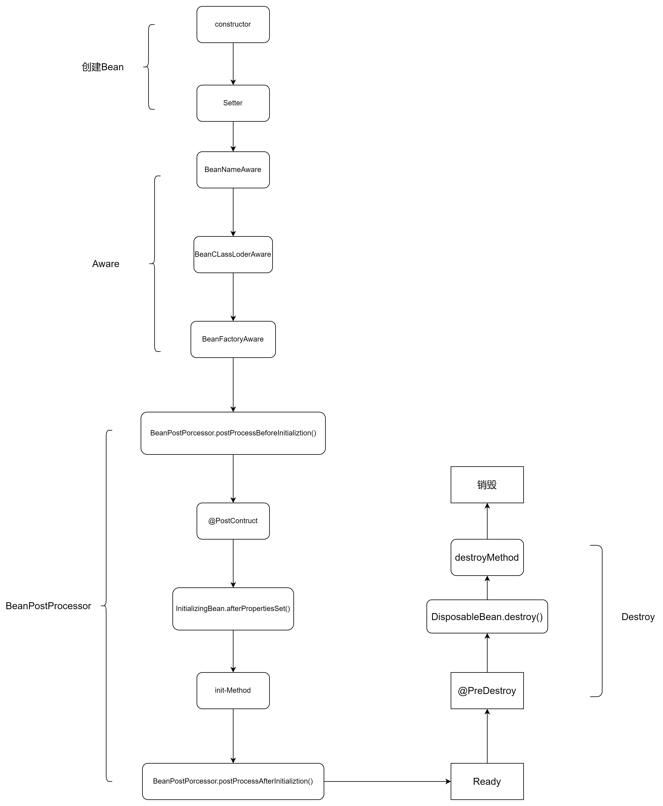

# what
Spring Aware 是 Spring 框架中的一个特性，它允许应用程序组件意识到 Spring 容器的存在并与之进行交互。

Spring Aware 的实现方式是通过实现特定的接口来实现的，这些接口包括以下几种：

ApplicationContextAware：实现该接口的组件可以获取到 Spring 的 ApplicationContext 对象，从而可以获取 Spring 容器中的其他 Bean，以及进行其他与容器相关的操作。

BeanFactoryAware：实现该接口的组件可以获取到 Spring 的 BeanFactory 对象，从而可以获取 Bean 的定义信息和其他与 BeanFactory 相关的操作。

MessageSourceAware：实现该接口的组件可以获取到 Spring 的 MessageSource 对象，从而可以获取国际化资源。

ApplicationEventPublisherAware：实现该接口的组件可以获取到 Spring 的 ApplicationEventPublisher 对象，从而可以发布自定义的事件。

ResourceLoaderAware：实现该接口的组件可以获取到 Spring 的 ResourceLoader 对象，从而可以加载资源文件。

通过实现以上接口，组件可以在初始化过程中获得对 Spring 容器的引用，从而可以利用容器提供的各种功能和资源。

Spring Aware 提供了一种简单而有效的方式，让组件与 Spring 容器进行交互，使得组件可以更加灵活地利用 Spring 的功能。同时，Spring Aware 也提供了一种扩展 Spring 框架的机制，使得开发者可以在需要的时候自定义自己的 Aware 接口，并通过实现该接口来与 Spring 容器进行交互。

# how

