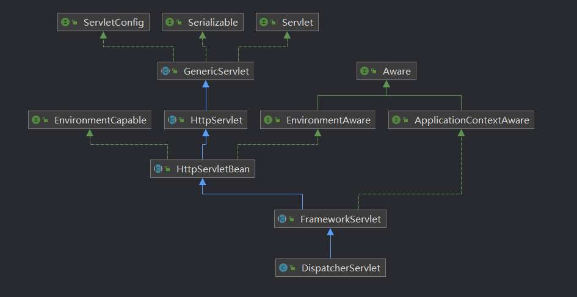
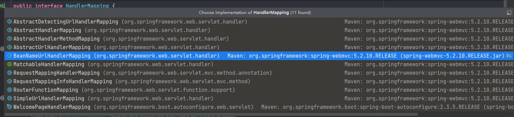

# 常见注解

为了更好的理解Spring的IOC与AOP特性,而不只是浮在表面。下面将介绍一些常见注解,以及如何debug代码,明白注解的实现。

举一个例子

```java
import javax.annotation.Resource;

@RestController
@RequestMapping(value = "app")
public class AppController {

    @Resource
    AppService appService;

    @RequestMapping(value = "/ping")
    public String ping() {
        return "pong";
    }

}

```

## @RestController

@RestController注解是一个特殊的@Controller，它包含了@ResponseBody注解。这意味着我们无需在每个方法上都添加@ResponseBody注解，因为当类使用@RestController注解时，就默认为所有方法都使用了@ResponseBody。
所以简单来说，@RestController是帮助我们更方便的创建RESTful Web服务的一种快捷方式

### how

@RestController由@Controller跟@ResponseBody,两个注解组成,

- @ResponseBody是标识当前请求是以restful风格返回JSON数据。
- @Controller 从继承 @Component,标识当前Bean需要被扫描,需要被Spring管理

```java

@Controller
@ResponseBody
public @interface RestController {

    @AliasFor(annotation = Controller.class)
    String value() default "";
}

@Component
public @interface Controller {
    @AliasFor(annotation = Component.class)
    String value() default "";
}

```

## @RequestMapping

要理解RequestMapping是如何实现,就是要学会理解SpringMvc是如何管理以及映射Mapping。


### DispatcheServlet

DispatchServlet核心的逻辑实现,主要由FrameworkServlet实现,

```java
public abstract class FrameworkServlet extends HttpServletBean implements ApplicationContextAware {

    protected final void initServletBean() throws ServletException {
        //创建Spring ApplictionContext
        this.webApplicationContext = initWebApplicationContext();

    }

    protected WebApplicationContext initWebApplicationContext() {

        //手动触发刷新
        if (!this.refreshEventReceived) {

            synchronized (this.onRefreshMonitor) {
                onRefresh(wac);
            }
        }
    }

}

public class DispatcherServlet extends FrameworkServlet {

    @Override
    protected void onRefresh(ApplicationContext context) {
        initStrategies(context);
    }

    protected void initStrategies(ApplicationContext context) {
        //资源映射
        initMultipartResolver(context);
        initLocaleResolver(context);
        initThemeResolver(context);
        //请求链路
        initHandlerMappings(context);
        initHandlerAdapters(context);
        initHandlerExceptionResolvers(context);
        //视图
        initRequestToViewNameTranslator(context);
        initViewResolvers(context);
        initFlashMapManager(context);
    }

    //initHandlerMapping方法如下，按照优先级排序后的HanlderMappings, 将来匹配时按照优先级最高的HanderMapping进行处理。
    private void initHandlerMappings(ApplicationContext context) {
        this.handlerMappings = null;
        //省略
        // Find all HandlerMappings in the ApplicationContext, including ancestor contexts.
        Map<String, HandlerMapping> matchingBeans =
                BeanFactoryUtils.beansOfTypeIncludingAncestors(context, HandlerMapping.class, true, false);
        if (!matchingBeans.isEmpty()) {
            this.handlerMappings = new ArrayList<>(matchingBeans.values());
            // We keep HandlerMappings in sorted order.
            AnnotationAwareOrderComparator.sort(this.handlerMappings);
        }
        //省略
    }
}
```

默认已经实现的HandlerMapping,
回到本文正题,@RequestMapping是如何将方法注入到Spring中,核心实现方法是RequestMappingHandlerMapping
```java
public class RequestMappingHandlerMapping extends RequestMappingInfoHandlerMapping
        implements MatchableHandlerMapping, EmbeddedValueResolverAware {

        @Override
        @SuppressWarnings("deprecation")
        public void afterPropertiesSet() {
            //
            super.afterPropertiesSet();
        }
}

public abstract class AbstractHandlerMethodMapping<T> extends AbstractHandlerMapping implements InitializingBean {
    private final Map<T, MappingRegistration<T>> registry = new HashMap<>();
    @Override
    public void afterPropertiesSet() {
        initHandlerMethods();
    }
    
    protected void initHandlerMethods() {
        for (String beanName : getCandidateBeanNames()) {
            if (!beanName.startsWith(SCOPED_TARGET_NAME_PREFIX)) {
                processCandidateBean(beanName);
            }
        }
        handlerMethodsInitialized(getHandlerMethods());
    }

    protected void processCandidateBean(String beanName) {
        //省略 isHandler 判断当前Bean是否属于有Controller或者RequestMapping注解
        if (beanType != null && isHandler(beanType)) {
            detectHandlerMethods(beanName);
        }
    }
    
    protected boolean isHandler(Class<?> beanType) {
        return (AnnotatedElementUtils.hasAnnotation(beanType, Controller.class) ||
                AnnotatedElementUtils.hasAnnotation(beanType, RequestMapping.class));
    }
    //省略其他方法 最终将其存放到registry中
    protected void registerHandlerMethod(Object handler, Method method, T mapping) {
        this.mappingRegistry.register(mapping, handler, method);
    }
}
```
如何存的介绍到这,那DispatchServlet是如何执行的呢
### 请求分发
DispatchServlet中doDispatch方法是真正处理请求的核心方法,
默认的处理逻辑RequestMappingHandlerAdapter,

```java
public class RequestMappingHandlerAdapter extends AbstractHandlerMethodAdapter
        implements BeanFactoryAware, InitializingBean {
    
    protected ModelAndView handleInternal(HttpServletRequest request,
                                          HttpServletResponse response, HandlerMethod handlerMethod) throws Exception {

        ModelAndView mav;
        checkRequest(request);
        //反射执行并且获取结果
        // Execute invokeHandlerMethod in synchronized block if required.
        if (this.synchronizeOnSession) {
            HttpSession session = request.getSession(false);
            if (session != null) {
                Object mutex = WebUtils.getSessionMutex(session);
                synchronized (mutex) {
                    
                    mav = invokeHandlerMethod(request, response, handlerMethod);
                }
            } else {
                // No HttpSession available -> no mutex necessary
                mav = invokeHandlerMethod(request, response, handlerMethod);
            }
        } else {
            // No synchronization on session demanded at all...
            mav = invokeHandlerMethod(request, response, handlerMethod);
        }
        
        return mav;
    }
}
```
invokeHandlerMethod 主要做的就是封装返回的ModelView,以及处理业务逻辑获取结果
```java
//省略很多无关的代码
public class InvocableHandlerMethod extends HandlerMethod {
    @Nullable
    protected Object doInvoke(Object... args) throws Exception {
        Method method = getBridgedMethod();
        ReflectionUtils.makeAccessible(method);
        return method.invoke(getBean(), args);
    }
}
```
到此,Mapping是如何映射,Mvc的工作流程有一个初步的认识。最重要的是理解了,为什么@Controller或者@RequestMapping是如何生效

### 每日一题
如果出现以下使用办法,回抛出404、找不到路由。想想为什么？
```java
@RestController
public abstract class AppController{
    
}
```
提示：Spring管理Bean一定是class类,如果是abstract class 或者 interface,是不会被扫描为Bean。想想为什么要这么做,回想一下三级缓存。


