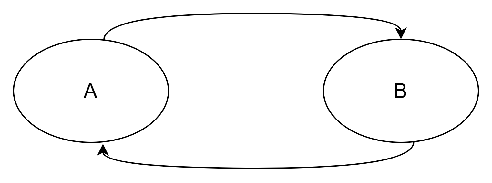
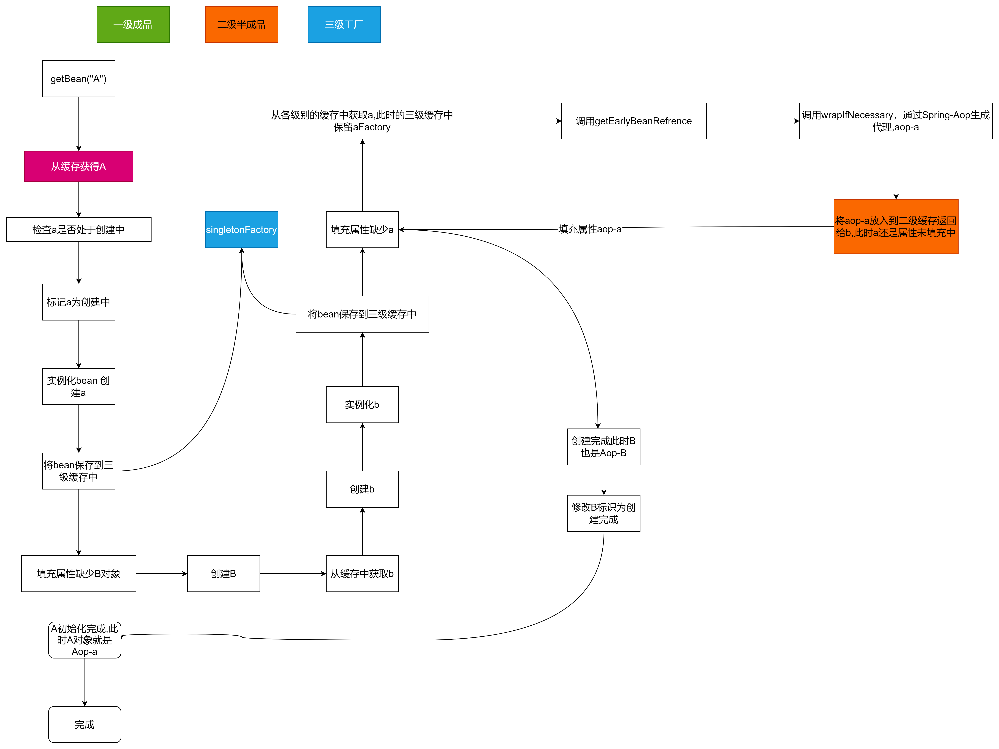

## 循环依赖问题

没吃过猪肉,总见过猪跑。大部分人可能没实际看过spring的源码,但背八股文的时候肯定知道spring是用三级缓存解决循环依赖的问题

### 一级缓存能否解决循环依赖问题呢？
A依赖B B依赖A完全OK
```java
private static final Map<String,Object> singleMap = new ConcurrentHashMap<>();


    public static void main(String[] args) throws Exception {
        System.out.println(getBean(B.class).getA());
        System.out.println(getBean(A.class).getB());
    }

    private static <T> T getBean(Class<T> beanClass) throws Exception {
        String beanName = beanClass.getSimpleName().toLowerCase();
        if (singleMap.containsKey(beanName)) {
            return (T) singleMap.get(beanName);
        }
        // 实例化对象入缓存
        Object obj = beanClass.newInstance();
        singleMap.put(beanName, obj);
        // 属性填充补全对象
        Field[] fields = obj.getClass().getDeclaredFields();
        for (Field field : fields) {
            field.setAccessible(true);
            Class<?> fieldClass = field.getType();
            String fieldBeanName = fieldClass.getSimpleName().toLowerCase();
            field.set(obj, singleMap.containsKey(fieldBeanName) ? singleMap.get(fieldBeanName) : getBean(fieldClass));
            field.setAccessible(false);
        }
        return (T) obj;
    }
}

class A {
    B b;

    public B getB() {
        return b;
    }

    public void setB(B b) {
        this.b = b;
    }
}

class B {
    A a;

    public A getA() {
        return a;
    }

    public void setA(A a) {
        this.a = a;
    }
}
-----------------------------------------
打印结果 
com.xiao.A@4f3f5b24
com.xiao.B@15aeb7ab
```
### 为什么spring不使用一级缓存解决问题呢


因为对象还有属性未被赋值,未被初始化。在spring的Bean生命周期中,bean存在实例化和初始化后的两种状态存在,
也可称之为半成品化和成品化。如果只有一级缓存(一个Map),是无法解决bean生命周期两个状态bean共存的这个问题。

### 二级缓存能解决问题吗？
假想一下两个缓存 一个存成品,一个存半成品是否能解决问题? 如果不能 可能会出什么问题？
如果仅仅是为了解决问题,当然是可以。但是spring没有采用这种方法地原因是Aop。
Aop的实现机制是在Bean最后一步,对Bean生成Aop-Target类。但如果只使用两级缓存,就会导致生成的Bean在实例化后就会创建。破坏了设计。

### Aop代理对象提前放入了三级缓存,没有经过初始化和属性填充,属性是什么时候被填充的呢？

Aop代理的是原始的bean,原始的bean在属性赋值的时候,保证了周期的完善。执行addSingletonFactory,将代理类移除二级缓存,加入一级缓存中

AbstractAutowireCapableBeanFactory
```java
		// Eagerly cache singletons to be able to resolve circular references
		// even when triggered by lifecycle interfaces like BeanFactoryAware.
		boolean earlySingletonExposure = (mbd.isSingleton() && this.allowCircularReferences &&
				isSingletonCurrentlyInCreation(beanName));
		if (earlySingletonExposure) {
			if (logger.isTraceEnabled()) {
				logger.trace("Eagerly caching bean '" + beanName +
						"' to allow for resolving potential circular references");
			}
			addSingletonFactory(beanName, () -> getEarlyBeanReference(beanName, mbd, bean));
		}
```

### spring为什么不能解决构造器的循环依赖？
如果使用构造器的循环依赖,则依赖对象就需要在构造函数中完成初始化。这时候就会出现问题,循坏依赖难以解决！！！！

### spring为什么不能解决prototype作用域的循环依赖？
此时生成的bean每次都是new的bean,并不会放在缓存中。但spring中循环依赖解决是通过缓存解决的

## 总结


举一个例子





