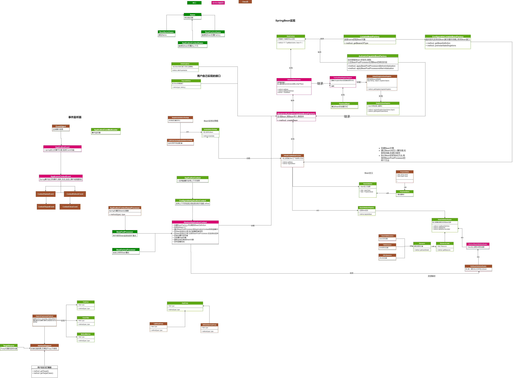

针对spring的IOC跟AOP等对应的核心代码,都过了一遍。目前回顾一下重点内容。

## FactoryBean如何注册对象,管理对象？
FactoryBean是一种能复杂实例化bean对象的工具,FactoryBean只是一个接口定义不是事件驱动或者反射实现,
```java
//This interface is heavily used within the framework itself, for example for the AOP org.springframework.aop.framework.ProxyFactoryBean or the org.springframework.jndi.JndiObjectFactoryBean. It can be used for custom components as well; however, this is only common for infrastructure code.
//FactoryBean is a programmatic contract. Implementations are not supposed to rely on annotation-driven injection or other reflective facilities. getObjectType() getObject() invocations may arrive early in the bootstrap process, even ahead of any post-processor setup. If you need access to other beans, implement BeanFactoryAware and obtain them programmatically.
public interface FactoryBean<T> {
    //省略部分代码
}
```
参考代码MyBaits的接口Mapper,注册Bean。
## BeanPostProcessor作用是什么?
```java
自定义修改bean实例,比如构造器的函数接口,代理类的封装
//Factory hook that allows for custom modification of new bean instances — for example, checking for marker interfaces or wrapping beans with proxies.
public interface BeanPostProcessor {
    
	@Nullable
	default Object postProcessBeforeInitialization(Object bean, String beanName) throws BeansException {
		return bean;
	}
	
	@Nullable
	default Object postProcessAfterInitialization(Object bean, String beanName) throws BeansException {
		return bean;
	}

}
```
BeanPostProcessor是一个接口
- postProcessBeforeInitialization方法会在bean实例化和属性设置之后，自定义初始化方法之前被调用，
- postProcessAfterInitialization方法会在自定义初始化方法之后被调用。
- 当容器中存在多个BeanPostProcessor的实现类时，会按照它们在容器中注册的顺序执行。
- 对于自定义的BeanPostProcessor实现类，还可以让其实现Ordered接口自定义排序。

*Aop*
AbstractAutoProxyCreator后置处理器的postProcessBeforeInstantiation方法中,核心代码
即bean对象初始化完成之后，后置处理器会判断该bean是否注册了切面，若是，则生成代理对象注入到容器中。
```java
        // Create proxy here if we have a custom TargetSource.
		// Suppresses unnecessary default instantiation of the target bean:
		// The TargetSource will handle target instances in a custom fashion.
		TargetSource targetSource = getCustomTargetSource(beanClass, beanName);
		if (targetSource != null) {
			if (StringUtils.hasLength(beanName)) {
				this.targetSourcedBeans.add(beanName);
			}
			Object[] specificInterceptors = getAdvicesAndAdvisorsForBean(beanClass, beanName, targetSource);
			Object proxy = createProxy(beanClass, beanName, specificInterceptors, targetSource);
			this.proxyTypes.put(cacheKey, proxy.getClass());
			return proxy;
		}
```
## @Autowired,@Qualifer,@Primary注解是如何获取Bean对象的吗？

### @Autowired
成员变量,方法,构造函数进行标注完成自动装配的工作。
1 @Autowired 默认是优先去容器中寻找对应的组件
```java
//applicationContext.getBean(类名.class);
```
2 如果找到多个同类型的组件,那么就将组件的id作为key
```java
//applicationContext.getBean("组件的id");
```

## BeanFactoryPostProcessor组件？
Bean实例化之前对bean的定义进行修改。

参考文章
- https://liayun.blog.csdn.net/article/details/110670961