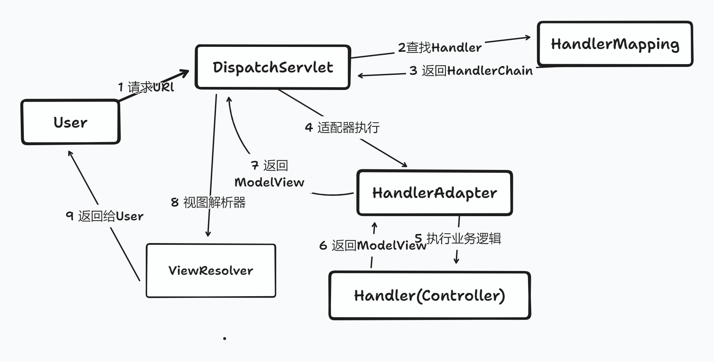

# SpringMvc解析流程
> 由于工作原因,需要重新回顾去思考SpringMvc的请求解析流程,特此记录说明

简易流程如图所示,互联网的项目都是采取前后分离模式开发项目,所以我们的关注点不在视图层的解析,而在前置处理,Handler,adapter处理等等


核心代码在 DispatchServlet中的doDispatch方法
```shell
protected void doDispatch(HttpServletRequest request, HttpServletResponse response) throws Exception {
   try {
      ModelAndView mv;
      boolean errorView = false;
      try {
         processedRequest = checkMultipart(request);
         //1 获取包含处理器Handler和拦截器AdapterIntercepters的处理器执行链HandlerExecutionChain
         mappedHandler = getHandler(processedRequest, false);
         if (mappedHandler == null || mappedHandler.getHandler() == null) {
            noHandlerFound(processedRequest, response);
            return;
         }
        //2 根据HandlerExecutionChain中的处理器Handler获取处理器适配器
         HandlerAdapter ha = getHandlerAdapter(mappedHandler.getHandler());
        // Process last-modified header, if supported by the handler.
         //3 拦截器pre预处理
         HandlerInterceptor[] interceptors = mappedHandler.getInterceptors();
         if (interceptors != null) {
            for (int i = 0; i < interceptors.length; i++) {
               HandlerInterceptor interceptor = interceptors[i];
               if (!interceptor.preHandle(processedRequest, response, mappedHandler.getHandler())) {
                  triggerAfterCompletion(mappedHandler, interceptorIndex, processedRequest, response, null);
                  return;
               }
               interceptorIndex = i;
            }
         }
        //4 获取真实的controller处理方法
         mv = ha.handle(processedRequest, response, mappedHandler.getHandler());
         // Do we need view name translation?
         if (mv != null && !mv.hasView()) {
            mv.setViewName(getDefaultViewName(request));
         }
         //5 拦截器post处理
         if (interceptors != null) {
            for (int i = interceptors.length - 1; i >= 0; i--) {
               HandlerInterceptor interceptor = interceptors[i];
               interceptor.postHandle(processedRequest, response, mappedHandler.getHandler(), mv);
            }
         }
      }
      //省略后续
}
```

## 第一点 GetHandler()
GetHandler实现依赖于HandlerMapping,HandlerMapping有两个最主要的实现类,AbstractHandlerMapping和MatchableHandlerMapping。

### AbstractHandlerMapping
获取HandlerExecutionChain,具体实现代码如下
```shell
	public final HandlerExecutionChain getHandler(HttpServletRequest request) throws Exception {
		//根据Request请求获取Handler
		Object handler = getHandlerInternal(request);
		if (handler == null) {
			handler = getDefaultHandler();
		}
		if (handler == null) {
			return null;
		}
		// Bean name or resolved handler?
		if (handler instanceof String) {
			String handlerName = (String) handler;
			handler = obtainApplicationContext().getBean(handlerName);
		}

		// Ensure presence of cached lookupPath for interceptors and others
		if (!ServletRequestPathUtils.hasCachedPath(request)) {
			initLookupPath(request);
		}

		HandlerExecutionChain executionChain = getHandlerExecutionChain(handler, request);
	    //省略
	}
```
getHandlerInternal的实现主要是AbstractHandlerMethodMapping实现,整个过程简单的概括一下
- 扫描注册@GetMapping,@RequestMapping类似的Bean
- 使用注册表MappingRegistry获取对应的Handler,通过Map获取
```shell
//nameLookup 属性 Mapping 的名字与 HandlerMethod 的映射。KEY 为 Mapping 的名字
private final Map<String, List<HandlerMethod>> nameLookup = new ConcurrentHashMap<>();
```

此时Handler,它是对Controller的Bean本身和请求Method的包装。而HandlerExecutionChain 是handler的二次包装，将handler与拦截器链关联到了一起。最终在在DispatcherServlet中完成了拦截器链对handler的过滤。


## 第二点 getHandlerAdapter()
adapter不太准确,应该是Executor,获取具体的执行方法,例如实现类SimpleControllerHandlerAdapter
```shell
    //判断Handler是不是Controller
	@Override
	public boolean supports(Object handler) {
		return (handler instanceof Controller);
	}
    //执行业务代码处理
	@Override
	@Nullable
	public ModelAndView handle(HttpServletRequest request, HttpServletResponse response, Object handler)
			throws Exception {
		return ((Controller) handler).handleRequest(request, response);
	}
```

## 第三点 preHandle,postHandle
HandlerChain拦截器,按照拦截链顺序处理,如果有异常则立即返回


## 最后一点 HandlerAdapter.handle(...)
真正的执行业务逻辑方法,其实交给HandlerAdapter的子类实现,最简单的例如SimpleControllerHandlerAdapter,如果有涉及到参数验证、解析则会交给RequestMappingHandlerAdapter处理


## 题外话
- HandlerMethodArgumentResolver作为一个参数校验解析器,可在生产实践中玩出各种花样。


