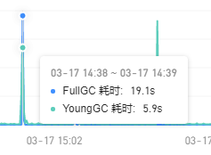
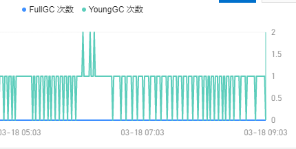

时间22年3月17号

> 特意记录一下,这次调优的心路历程。因为耗时很多,循序渐进的定位问题.

问题原因,线上接口出现大面积超时,full gc时间为10多秒



先上jvm参数配置,gc算法没改,一切参数都没调优
```shell
-Xms10g -Xmx10g
```
younggc 一直很多,陆续大概10分钟出现一次,推测是定时器相关的代码出现了问题。full gc时间超时,怀疑也是因为这个引起。

先dump内存信息, jmap -dump:format=b,file=x pid(java 进程ID)


以上的图是利用mat的分析工具得到,


然后找到对应的点,去怀疑,去佐证,最后再加一句去google。找到下面的issue,最终用jackjson替换掉暂时解决掉。
<font color="red">bug</font>[https://github.com/alibaba/fastjson/issues/1286](https://github.com/alibaba/fastjson/issues/1286)


时间22年3月18号

> 接着调优,现在的问题是针刺问题


接着按照上诉的步骤调优,结果发现了阿里druid的一个问题


问题点在于,程序中有大量的批插入情况发生,而且是没有办法缓存的,所有就导致map越来越大。怎么解决参考如下的图

[参考博客](https://blog.csdn.net/zzy7075/article/details/121633165)


