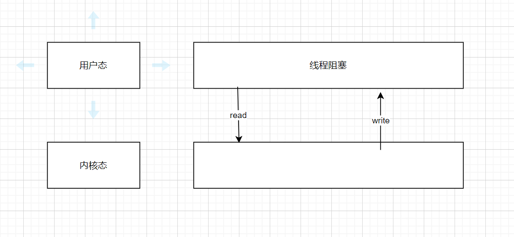
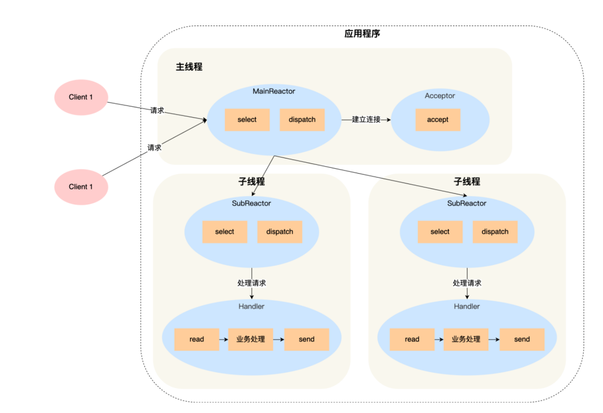

## BIO NIO AIO

同步阻塞IO

如果没有读取到数据会一直阻塞

非阻塞IO
发出指令的时候会立刻返回,正常流程中当数据准备好,会将数据拷贝到对应的线程中继续执行。

异步IO
AIO 叫做异步非阻塞的 I/O，引入了异步通道的概念，采用了 Proactor 模式，简化了程序编写，有效的请求才会启动线程，特点就是先由操作系统完成后才通知服务端程序启动线程去处理，一般用于连接数较多且连接时长较长的应用。

## Reactor

> 非阻塞同步网络模型

### 核心组成
主要由 Reactor 和处理资源池这两个核心部分组成，它俩负责的事情如下：
- Reactor 负责监听和分发事件，事件类型包含连接事件、读写事件；
- 处理资源池负责处理事件，如 read -> 业务逻辑 -> send；

> 因为Reactor是灵活多变的,Reactor数量可以是一个也可以是多个。处理的资源池可以是单进程/线程,也可以是多进程/线程

Java中netty框架使用多Reactor多线程模型

