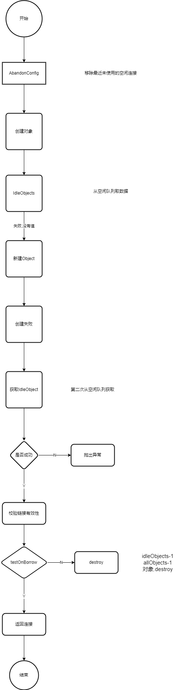

> 最近在研究Jedis的源码实现部分，主要分几个章节讲从源码的角度上讲使用jedis的注意事项

老规矩,举一个栗子,日常开发中如何使用Jedis
Jedis实现可提供两种实现,分为单机,集群模式

Jedis的Pool配置如下
```java
  JedisPoolConfig poolConfig = new JedisPoolConfig();
  poolConfig.setMaxTotal(5);
  poolConfig.setMaxIdle(3);
  poolConfig.setMinIdle(1);
  poolConfig.setMaxWaitMillis(3000);
  poolConfig.setTestOnReturn(true);
  poolConfig.setTestOnBorrow(true);
```
弄清楚redis的配置能更好的帮助我们开发

## MaxTotal(最大连接数),MaxIdle(业务实际使用的连接数)，MinIdle(最小空闲连接数)
- 资源限制：nodes * maxTotal不能超过Redis的最大连接数

计算:
假如redis每次命令request+response时间是1ms, 1s/1ms。业务方希望达到的QPS是50000, 50000/1ms*1000=50。 MaxIdle=50

建议设置:
MaxTotal>=MaxIdle ; MaxIdle/100|MaxIdle/10=MinIdle


## TestOnBorrow
> 源码之下没有秘密,不熟悉没有关系,多看多google。

```java
public abstract class Pool<T> implements Closeable {
   //......
  public T getResource() {
    //.....
      return internalPool.borrowObject();
    //.....
  }
  //.....
}
```
池的实现逻辑,主要依赖apache-common下GenericObjectPool实现,实现流程图如下
```java
public class GenericObjectPool<T> extends BaseGenericObjectPool<T>
        implements ObjectPool<T>, GenericObjectPoolMXBean, UsageTracking<T> {
    public T borrowObject(final long borrowMaxWaitMillis) throws Exception {
        
    }
}
```



解答问题
TestOnBorrow作用是保证每一次获取的连接都是真实可用的

## TestOnReturn
代码实现参考：
```java
public class Jedis {  
  @Override
  public void close() {
    if (dataSource != null) {
      JedisPoolAbstract pool = this.dataSource;
      this.dataSource = null;
      if (isBroken()) {
        pool.returnBrokenResource(this);
      } else {
        pool.returnResource(this);
      }
    } else {
      super.close();
    }
  }
}
```
GenericObjectPool实现类

```shell script
  if (getTestOnReturn() && !factory.validateObject(p)) {
            try {
                destroy(p, DestroyMode.NORMAL);
            } catch (final Exception e) {
                swallowException(e);
            }
            try {
                ensureIdle(1, false);
            } catch (final Exception e) {
                swallowException(e);
            }
            updateStatsReturn(activeTime);
            return;
  }
```
解答问题
TestOnReturn作用是保证close后,放回池里的链接是正确的。而不是无效的


### 总结
Jedis的Pool实现依靠apache-common-pool的实现，使用模板模式,将具体的jedis的创建,销毁,归还交给JedisFactory实现。


