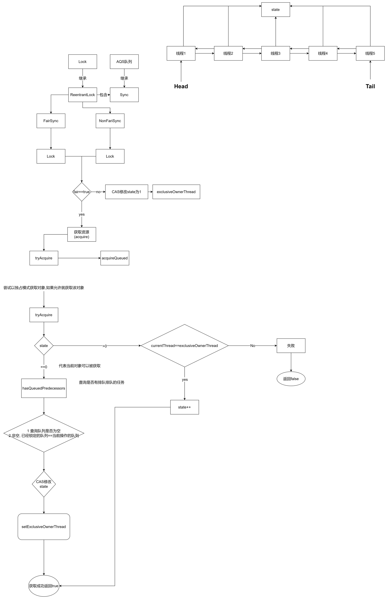
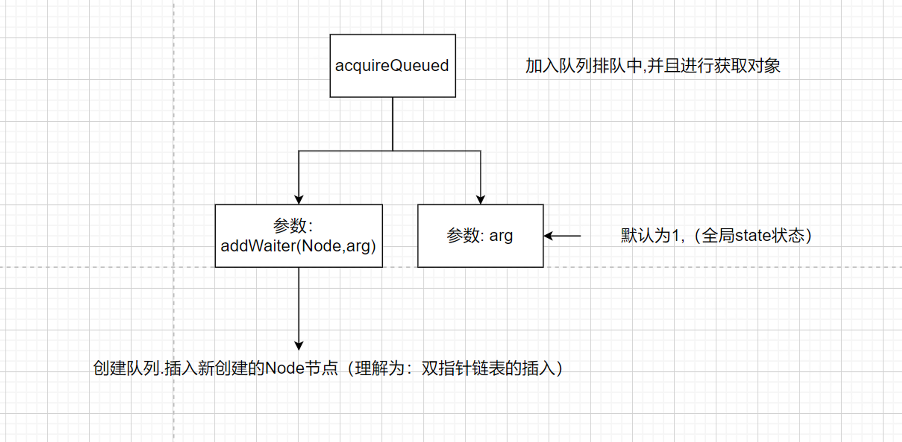
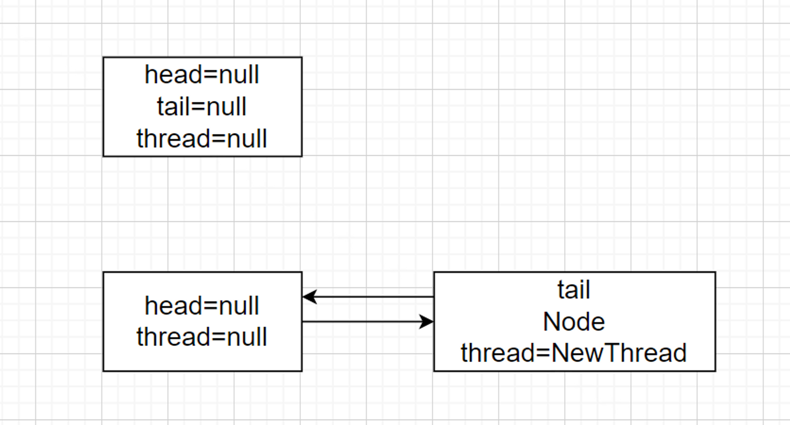
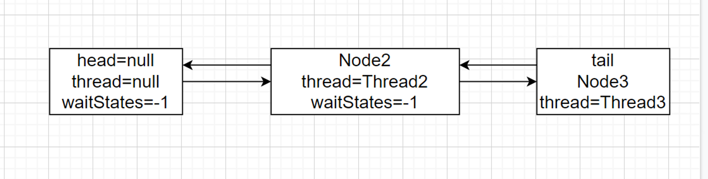

#what
ReentrantLock是Java中的一个线程同步机制，它实现了Lock接口。与synchronized关键字相比，ReentrantLock提供了更灵活的锁定操作。


#how
使用
```java
import java.util.concurrent.locks.ReentrantLock;

public class ReentrantLockExample {
    private ReentrantLock lock = new ReentrantLock();

    public void doSomething() {
        lock.lock();
        try {
            // 执行需要同步的代码块
        } finally {
            lock.unlock();
        }
    }
}
```

## 原理说明
流程梳理图如下


根据流程图如何从CLH队列中选择合适的排队线程,以及工作原理呢
acquireQueued()



addWaiter(Node,arg)



第一种情况：第一次获取对象锁失败,此时还被其他线程占用

if (p == head && tryAcquire(arg)) {//省略}

此时p==head 是True，执行获取tryAcquire(1) 的时候,能够成功获得对象
```java
public abstract class AbstractQueuedSynchronizer
        extends AbstractOwnableSynchronizer
        implements java.io.Serializable {
    //省略
    final boolean acquireQueued(final Node node, int arg) {
        boolean failed = true;
        try {
            boolean interrupted = false;
            for (; ; ) {
                final Node p = node.predecessor();
                //第一种情况
                if (p == head && tryAcquire(arg)) {
                    setHead(node);
                    p.next = null; // help GC
                    failed = false;
                    return interrupted;
                }
                
                if (shouldParkAfterFailedAcquire(p, node) &&
                        parkAndCheckInterrupt())
                    interrupted = true;
            }
        } finally {
            if (failed)
                cancelAcquire(node);
        }
    }
}
```
第二种情况：   新加入一个Node排队中
```shell
if (shouldParkAfterFailedAcquire(p, node) && parkAndCheckInterrupt()){//省略}
```



`shouldParkAfterFailedAcquire`

当前的节点获取资源是需要由前置节点唤醒, 第一次循环进入`shouldParkAfterFailedAcquire`是返回的false，此时的waitStatus是默认值, 将它设置为`Node.*SIGNAL。` 第二次进入循环 if(ws==Node.SIGNAL) 为true 直接返回true*

```shell
private static boolean shouldParkAfterFailedAcquire(Node pred, Node node) {
        int ws = pred.waitStatus;
        if (ws == Node.SIGNAL)
            /*
             * This node has already set status asking a release
             * to signal it, so it can safely park.
             */
            return true;
        if (ws > 0) {
            /*
             * Predecessor was cancelled. Skip over predecessors and
             * indicate retry.
             */
            do {
                node.prev = pred = pred.prev;
            } while (pred.waitStatus > 0);
            pred.next = node;
        } else {
            /*
             * waitStatus must be 0 or PROPAGATE.  Indicate that we
             * need a signal, but don't park yet.  Caller will need to
             * retry to make sure it cannot acquire before parking.
             */
            compareAndSetWaitStatus(pred, ws, Node.SIGNAL);
        }
        return false;
    }
```

parkAndCheckInterrupt()

```shell
private final boolean parkAndCheckInterrupt() {
			//挂起当前的线程,等待被前置节点唤醒
        LockSupport.park(this);
        return Thread.interrupted();
    }
```

### 解锁操作

```java
public final boolean release(int arg) {
        if (tryRelease(arg)) {
            Node h = head;
            if (h != null && h.waitStatus != 0)
                unparkSuccessor(h);
            return true;
        }
        return false;
    }
```

`tryRelease: AQS队列中的state,exclusiveOwnerThread 设置为空`

`head的waitStatus不为空,则代表当前队列中存在线程、需要被唤醒获取资源。`

**unparkSuccessor(h)**

```java
private void unparkSuccessor(Node node) {
        /*
         * If status is negative (i.e., possibly needing signal) try
         * to clear in anticipation of signalling.  It is OK if this
         * fails or if status is changed by waiting thread.
         */
        int ws = node.waitStatus;
        if (ws < 0)
            compareAndSetWaitStatus(node, ws, 0);
				//从尾节点忘前找,找到一个合适的头唤醒
        Node s = node.next;
        if (s == null || s.waitStatus > 0) {
            s = null;
            for (Node t = tail; t != null && t != node; t = t.prev)
                if (t.waitStatus <= 0)
                    s = t;
        }
        if (s != null)
					  //唤醒之前park的线程,继续往后执行
            LockSupport.unpark(s.thread);
    }
```

总结：

1. 锁状态。我们要知道锁是不是被别的线程占有了，这个就是 state 的作用，它为 0 的时候代表没有线程占有锁，可以去争抢这个锁，用 CAS 将 state 设为 1，如果 CAS 成功，说明抢到了锁，这样其他线程就抢不到了，如果锁重入的话，state进行 +1 就可以，解锁就是减 1，直到 state 又变为 0，代表释放锁，所以 lock() 和 unlock() 必须要配对啊。然后唤醒等待队列中的第一个线程，让其来占有锁。
2. 线程的阻塞和解除阻塞。AQS 中采用了 LockSupport.park(thread) 来挂起线程，用 unpark 来唤醒线程。
3. 阻塞队列。因为争抢锁的线程可能很多，但是只能有一个线程拿到锁，其他的线程都必须等待，这个时候就需要一个 queue 来管理这些线程，AQS 用的是一个 FIFO 的队列，就是一个链表，每个 node 都持有后继节点的引用。

### 公平锁与非公平锁的区别

- 非公平锁会在lock后,首先就调用cas进行一次抢锁,如果刚好锁没有被占用,直接获取锁返回
- 非公平锁在 CAS 失败后，和公平锁一样都会进入到 tryAcquire 方法，在 tryAcquire 方法中，如果发现锁这个时候被释放了（state == 0），非公平锁会直接 CAS 抢锁，但是公平锁会判断等待队列是否有线程处于等待状态，如果有则不去抢锁，乖乖排到后面

公平锁和非公平锁就这两点区别，如果这两次 CAS 都不成功，那么后面非公平锁和公平锁是一样的，都要进入到阻塞队列等待唤醒。
相对来说，非公平锁会有更好的性能，因为它的吞吐量比较大。当然，非公平锁让获取锁的时间变得更加不确定，可能会导致在阻塞队列中的线程长期处于饥饿状态
