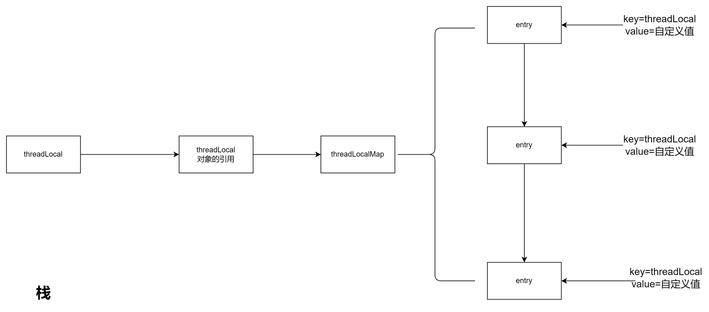

# what

ThreadLocal是Java中的一个类，用于创建线程局部变量。它允许每个线程拥有自己独立的变量副本，而不会相互干扰。通常情况下，如果多个线程共享同一个变量，会导致线程安全问题。但是通过ThreadLocal，每个线程可以访问自己的变量副本，从而避免了线程安全问题。

使用ThreadLocal，可以在每个线程中存储和获取特定的值，而不需要使用同步机制。每个线程都可以独立地修改自己的变量副本，而不会影响其他线程的副本。

ThreadLocal的典型用法是在多线程环境下实现线程安全的单例模式。通过将单例对象存储在ThreadLocal中，可以保证每个线程都拥有自己独立的单例对象。

需要注意的是，使用ThreadLocal时要注意内存泄漏问题。由于ThreadLocal是线程级别的变量，如果在使用完毕后没有手动清除，可能会导致对象无法被垃圾回收，进而造成内存泄漏。因此，使用ThreadLocal时应该及时清理不再使用的变量副本。


# how



- 斐波拉契散列

使用如下的几张方式计算hash散列

```shell
int HASH_INCREMENT=0x61c88647
hashCode = (i * HASH_INCREMENT + HASH_INCREMENT)&(size-1);
```

- 存储结构
threadLocal是使用threadlocalMap进行存放数据，thread作为key。泛型的值作为value。

- 内存泄漏

内存泄漏：指程序中已经动态分配的堆内存由于某种原因无法释放,造成系统内存的浪费，导致程序运行速度减缓甚至系统崩溃。

为什么会造成内存泄漏？

因为threadLocalMap中的entry的key是WeakReference,本应在每次内存回收的时候或者在扩容,replace值的时候进行清空。但如果出现当前线程结束,则当前线程引用=null, key=null 但value依然存在。


