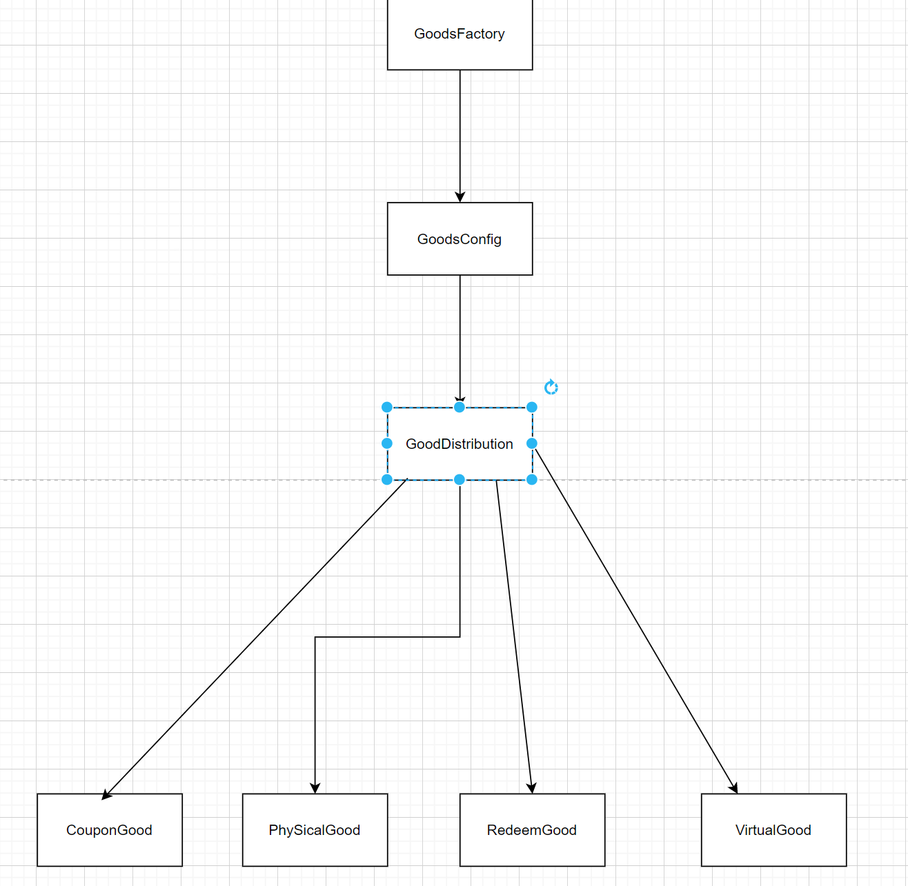

## 工厂模式

### 解决什么问题？
> 解决new对象，不同代码逻辑的问题。


### talk is cheap , show me the code。
每年的年终,年中平台大促期间,会设置发奖流程。发奖会存在多种方式,1 虚拟奖品(平台会员) 2 兑换码 3优惠券 4 实物奖品(相机,手机等)



```java
/**
 * 商品发奖流程
 * @author carl
 */
public interface GoodDistribution {

    /**
     * 执行发奖方式
     */
    void Distribution();

    /**
     * 发奖枚举类
     * @return
     */
    int distributionCode();
}
```

```java
/**
 * @author carl
 */
@Component
public class CouponGood implements GoodDistribution{
    @Override
    public void Distribution() {
        //......
    }

    @Override
    public int distributionCode() {
        return AwardType.CouponGood.getCode();
    }
}
@Component
public class PhysicalGoods implements GoodDistribution{
  @Override
  public void Distribution() {
    //......
  }

  @Override
  public int distributionCode() {
    return AwardType.PHYSICALGOOD.getCode();
  }
}
/**
 * @author carl
 */
@Component
public class RedeemCodeGoods implements GoodDistribution{
  @Override
  public void Distribution() {
    System.out.println("发送兑换奖品");
  }

  @Override
  public int distributionCode() {
    return AwardType.RedeemCodeGoods.getCode();
  }
}
/**
 * @author carl
 */
@Component
public class VirtualDistribution implements GoodDistribution{

  @Override
  public void Distribution() {
    System.out.println("发送虚拟奖品");
  }

  @Override
  public int distributionCode() {
    return AwardType.Virtual.getCode();
  }

}
```
```java
public class GoodsConfig {

    protected static Map<Integer,GoodDistribution> goodDistributionMap = new HashMap<>();

    @Resource
    PhysicalGoods physicalGoods;

    @Resource
    CouponGood couponGood;

    @Resource
    RedeemCodeGoods redeemCodeGoods;

    @Resource
    VirtualDistribution virtualDistribution;

    @PostConstruct
    public void init(){
        goodDistributionMap.put(AwardType.CouponGood.getCode(),couponGood);
        goodDistributionMap.put(AwardType.PHYSICALGOOD.getCode(),physicalGoods);
        goodDistributionMap.put(AwardType.RedeemCodeGoods.getCode(),redeemCodeGoods);
        goodDistributionMap.put(AwardType.Virtual.getCode(),virtualDistribution);
    }
}

/**
 * @author carl
 */
@Service
public class GoodsFactory extends GoodsConfig{

  public GoodDistribution getDistributionGoodsService(Integer awardType){
    return goodDistributionMap.get(awardType);
  }
}
```


### 简单工厂模式,工厂方法模式,抽象工厂模式三者区别？

- 简单工厂模式/工厂方法模式
> 当对象的创建逻辑比较复杂，不只是简单的 new 一下就可以，而是要组合其他类对象，做各种初始化操作的时候，我们推荐使用工厂方法模式，

- 抽象工厂模式

> 工厂方法类中只有一个抽象方法，要想实现多种不同的类对象，只能去创建不同的具体工厂方法的子类来实列化，而抽象工厂 则是让一个工厂负责创建多个不同类型的对象


Spring Boot启动主要包括以下步骤：

- 加载Spring Boot启动类（通常是带有@SpringBootApplication注解的类）
- 扫描启动类所在包以及子包，找到所有的@Component、@Controller、@Service和@Repository等注解的类
- 根据扫描到的类创建BeanDefinition对象，并加入BeanDefinitionRegistry中
- 对所有的BeanDefinition进行实例化，创建Bean对象
- 对所有的Bean进行依赖注入
- 调用所有实现了CommandLineRunner和ApplicationRunner接口的Bean的run方法
- 启动Spring Boot应用
  2023-02-23 07:06
  小傅哥：Bean的生命周期主要包括以下阶段：

- 实例化：Spring容器根据Bean的定义创建Bean实例。
- 属性赋值：Spring容器将Bean的属性赋值。
- Aware接口回调：如果Bean实现了Aware接口，则Spring容器将回调Aware接口的方法。
- BeanPostProcessor前置处理：如果Bean实现了BeanPostProcessor接口，则Spring容器将调用BeanPostProcessor的postProcessBeforeInitialization方法。
- 初始化：Spring容器调用Bean的初始化方法，如果Bean实现了InitializingBean接口，则调用afterPropertiesSet方法；如果在配置文件中定义了init-method，则调用配置的初始化方法。
- BeanPostProcessor后置处理：如果Bean实现了BeanPostProcessor接口，则Spring容器将调用BeanPostProcessor的postProcessAfterInitialization方法。
- 使用：Bean可以被应用程序使用。
- 销毁：如果Bean实现了DisposableBean接口，则在容器关闭时，Spring容器将调用destroy方法；如果在配置文件中定义了destroy-method，则调用配置的销毁方法。
  2023-02-23 07:07
  小傅哥：Netty的Reactor模式采用了多线程的方式，通过一个或多个Selector监听多个Channel的事件，当Channel发生事件时，会向Selector注册的某个线程池提交任务进行处理，从而实现高并发的I/O处理。

Netty的work线程阻塞问题可以通过以下解决方案：

- 增加工作线程数：通过增加工作线程数，可以提高系统的并发能力，从而缓解阻塞的问题。
- 优化处理逻辑：通过优化处理逻辑，减少工作线程的负载，从而缓解阻塞的问题。
- 异步处理：采用异步处理的方式，将工作线程从阻塞的任务中解放出来，从而提高系统的并发能力。
  2023-02-23 07:07
  小傅哥：RocketMQ通过以下机制来保证消息零丢失：

- 同步刷盘：在消息发送时，将消息持久化到磁盘，并等待磁盘IO操作完成后才返回发送成功，从而保证消息的持久化。
- 异步刷盘：将消息发送到内存缓存，然后异步将消息持久化到磁盘中，从而提高消息发送的性能。
- 复制机制：RocketMQ采用了主从复制的机制，即在发送消息时，将消息发送到主节点，主节点将消息持久化到磁盘中后，再将消息复制到多个从节点上，从而实现消息的冗余备份。
- 刷盘策略：RocketMQ提供了多种刷盘策略，例如同步刷盘、异步刷盘、定时刷盘等，可以根据实际情况进行选择。

通过以上机制的协同作用，RocketMQ可以实现消息的零丢失。
2023-02-23 07:07
小傅哥：当Topic中MessageQueue的数量已经等于Consumer的实例数量时，说明消息消费速度已经跟不上消息生产速度，可能会导致消息堆积问题。解决该问题可以采用以下方法：

- 增加Consumer实例数量：增加Consumer实例数量可以提高消息消费的并发能力，从而缓解消息堆积问题。
- 增加Topic的MessageQueue数量：增加Topic的MessageQueue数量可以将消息分散到更多的MessageQueue中，从而提高消息的并发处理能力。
- 调整消息生产速度：调整消息生产速度，限制消息的发送频率，从而缓解消息堆积问题。
  2023-02-23 07:08
  小傅哥：6：MySQL的锁机制主要包括以下两种类型的锁：

- 共享锁（S锁）：多个事务可以共享一把共享锁，读取数据时不会阻塞其他读操作，但会阻塞写操作。
- 排他锁（X锁）：排他锁只允许一个事务进行加锁，其他的读和写操作都会被阻塞。

MVCC（Multi-Version Concurrency Control）多版本并发控制是一种并发控制技术，用于解决数据库并发访问时的读写冲突问题。它通过在数据库中保存多个版本的数据，使得读写操作可以并发执行，从而提高数据库的并发能力。

MVCC的实现机制是：在每个数据行中增加两个隐藏的列，一个记录创建时间，一个记录删除时间。对于每个事务，MySQL根据其启动时间和提交时间确定可见的数据版本，即只能看到在该时间段内未被删除的数据。这样，多个事务就可以并发执行读操作，而不会互相干扰。
2023-02-23 07:08
小傅哥：7：DDD（Domain Driven Design）是一种面向领域的设计方法，通过对业务领域进行建模，实现业务与技术的有机结合。在项目中，可以通过以下方式运用DDD：

- 划分子域：将整个业务领域划分为多个子域，每个子域关注自身的业务问题和数据模型，便于系统分层和模块化。
- 定义领域模型：对每个子域进行领域建模，包括实体、值对象、聚合根等，通过领域模型来描述业务对象之间的关系和行为。
- 实现业务逻辑：根据领域模型来实现业务逻辑，保证代码与业务逻辑的一致性，降低代码复杂度。
- 实现领域服务：对于跨域的业务逻辑，可以实现领域服务来处理，保证业务逻辑的内聚性和可重用性。
- 使用领域事件：通过领域事件来实现领域对象之间的解耦和松散耦合，降低系统的复杂度。
- 实现聚合和聚合根：将领域对象按照一定的规则组合成聚合和聚合根，便于系统的分层和模块化。

通过以上方式的运用，可以使得系统更加符合业务需求和逻辑，同时保证代码的可维护性和可扩展性。
2023-02-23 07:09
小傅哥：8：Spring Boot会根据项目中引入的依赖和配置文件，自动选择加载哪个Starter。具体的加载顺序如下：

- Spring Boot会先扫描项目中的所有依赖，找出包含META-INF/spring.factories文件的Starter。
- 然后根据spring.factories文件中的配置，加载对应的自动配置类。
- 如果存在多个自动配置类，则会根据自动配置类的条件进行选择，最终只会加载一个自动配置类。
- 如果存在多个Starter，可以通过在配置文件中指定spring.autoconfigure.exclude属性来排除某个Starter的自动配置。

通过以上机制，Spring Boot可以根据项目的依赖和配置文件，自动选择加载哪个Starter，从而方便开发人员进行快速开发。


https://www.bantanger.tk/pages/4a2dbc/


[comment]: <> (1. 从描述上来看，你这里应该是没有太多的复杂流程，主要为拉取数据和存放。对数据库的压力是较大的。之后可能你的一条MQ消息会有较大的数据是吧？)

[comment]: <> (2. 分布式项目的压测，通常也是压一组服务，比如这一组服务的接口、MQ主题、到压测库都是独立的，不影响主线业务即可。压测的时候可以先单实例压测，之后多实例压测，之后多接口并发交叉压测，之后是稳定性压测持续一段时间看效果。这些数据都可以记录下来。)

[comment]: <> (3. 可以从以下几方面思考亮点；)

[comment]: <> (   3.1 高并发处理能力，分布式架构、多节点、多线程等技术，保证数据质量的前提下，能够支持高并发的数据处理和查询。)

[comment]: <> (   3.2 实时性能优化类，埋点技术、Kafka等技术，实时监控系统性能，对性能瓶颈进行优化和调整，保证系统的实时性能优化。)

[comment]: <> (   3.3 数据的安全可靠，该项目采用了多节点、多实例、数据备份、数据的补偿机制、低延迟等技术，确保数据的安全可靠性。—— 另外气象局是否会有实时性要求，这可以引入时序数据库。)

[comment]: <> (   3.4 高并发容量支持，日处理数据量达到6000w，能够支持高容量的数据处理和查询)