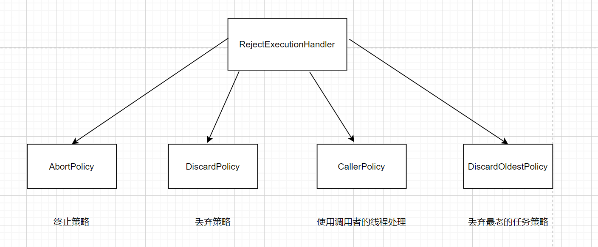

## 策略模式

### 解决问题？
> 主要是针对不同的策略做出对应行为

### 工厂模式与策略模式有什么区别？
- 工厂模式是属于创建型设计模式，主要用来针对不同类型创建不同的对象，达到解偶类对象。
- 策略模式主要是针对不同的策略做出对应行为

### demo
ThreadPoolExecutor的拒绝策略
```java
public interface RejectedExecutionHandler {

    /**
     * Method that may be invoked by a {@link ThreadPoolExecutor} when
     * {@link ThreadPoolExecutor#execute execute} cannot accept a
     * task.  This may occur when no more threads or queue slots are
     * available because their bounds would be exceeded, or upon
     * shutdown of the Executor.
     *
     * <p>In the absence of other alternatives, the method may throw
     * an unchecked {@link RejectedExecutionException}, which will be
     * propagated to the caller of {@code execute}.
     *
     * @param r the runnable task requested to be executed
     * @param executor the executor attempting to execute this task
     * @throws RejectedExecutionException if there is no remedy
     */
    void rejectedExecution(Runnable r, ThreadPoolExecutor executor);
}
```




### 总结
- 策略模式是如何优化业务逻辑代码结构的？
抽象了出了接口，将业务逻辑封装成一个一个的实现类，任意地替换。在复杂场景（业务逻辑较多）时比直接 if else 来的好维护些。