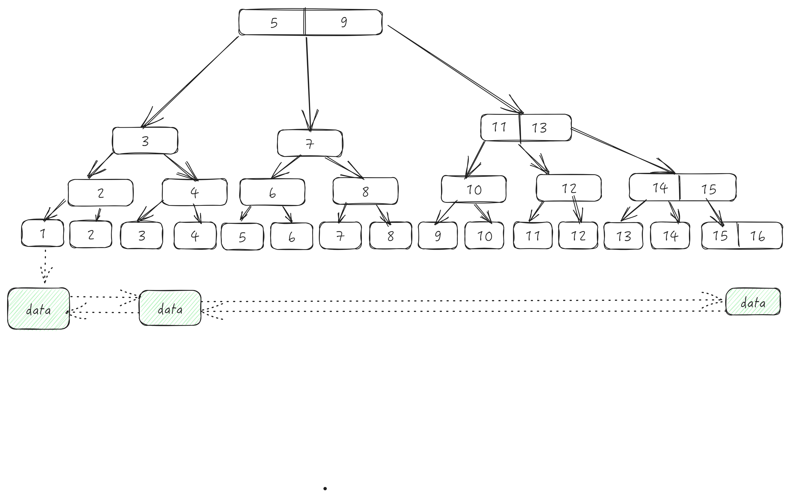

# 索引
索引的意义不言而喻,对于云服务厂商数据库,一条慢SQL或者锁表。拖垮整个库是轻而易举的一件事,懂得索引的基本数据结构,以及学会调优是非常重要的一件事。
## 基本数据结构(B+树)

对于Inoodb引擎而言,索引与数据是一起存放的。数据全放在叶子节点,非叶子节点存放的是索引,索引又区分为(聚簇索引与非聚簇索引)。

## 聚簇索引Vs非聚簇索引
聚簇索引通常又称为主键索引,如果没有显示的创建主键,则会创建一个默认(ROWID)

## 索引优化
业务场景的多变,创建合适的索引是很难的,不得不向业务妥协,产品经理妥协,测试同学妥协。
大量的调优是必不可少的,尽可能的把SQL执行时间降低到2s下,根据个人经验,总结了一些调优的方案。
### 最左前缀匹配
业务开发写胶水代码的时候,不像考试。能够依据条件,创建合适的索引、更多时候使用多个column创建一个索引。

