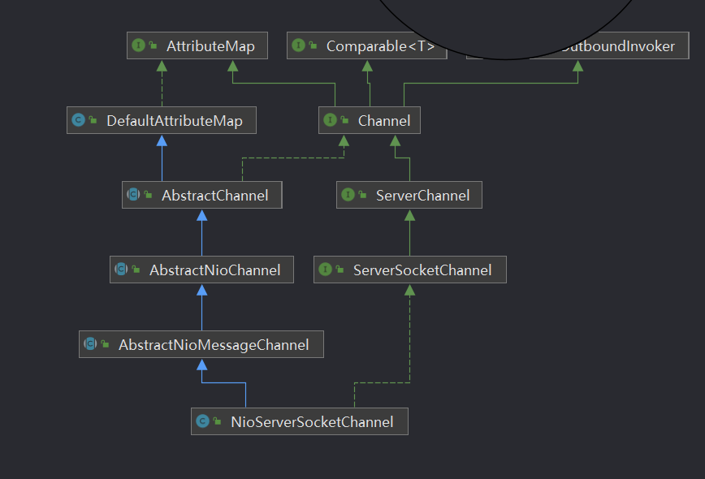

数据来源: bin的技术小屋

NioServerSocketChannle的类依赖关系图


## AbstractNioChannel
构造函数
```shell
  //JDK 原生NIO的操作集合
  private final SelectableChannel ch;
  //OP_ACCEPT事件
  protected final int readInterestOp;

protected AbstractNioChannel(Channel parent, SelectableChannel ch, int readInterestOp) {
        super(parent);
        this.ch = ch;
        this.readInterestOp = readInterestOp;
        try {
             //设置非阻塞模式
            ch.configureBlocking(false);
        } catch (IOException e) {
          //异常处理
        }
    }
```

## AbstractChannel
```shell
    private final Channel parent;
    //唯一ID 
    private final ChannelId id;
    //unsafe用于封装对底层socket的相关操作
    private final Unsafe unsafe;
    //为channel分配独立的pipeline用于IO事件编排
    private final DefaultChannelPipeline pipeline;

  protected AbstractChannel(Channel parent) {
        this.parent = parent;
        id = newId();
        unsafe = newUnsafe();
        pipeline = newChannelPipeline();
    }
```
在写业务逻辑的时候,需要关心DefaultChannelPipeline
> pipeline其实是一个ChannelHandlerContext类型的双向链表。头结点HeadContext,尾结点TailContext。ChannelHandlerContext中包装着ChannelHandler

Reactor分析
[https://www.cnblogs.com/binlovetech/p/16444271.html](https://www.cnblogs.com/binlovetech/p/16444271.html)
- NioServerSocketChannel只处理Accept事件
- NioSocketChannel 处理 Read/Write事件


