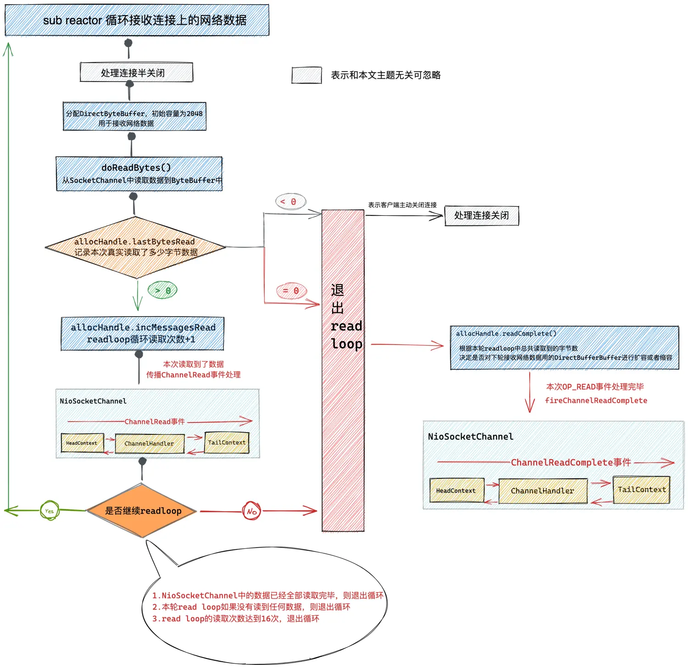

## NioSocketChannel
read读取数据

```shell
public final void read() {
            final ChannelConfig config = config();
            if (shouldBreakReadReady(config)) {
                clearReadPending();
                return;
            }
            //获取pipeline
            final ChannelPipeline pipeline = pipeline();
            //ByteBuf的分配器 PooledByteBufAllocator为Netty中的内存池，用来管理堆外内存DirectByteBuffer。
            final ByteBufAllocator allocator = config.getAllocator();
            //自适应ByteBuf分配器 AdaptiveRecvByteBufAllocator ,用于动态调节ByteBuf容量
            final RecvByteBufAllocator.Handle allocHandle = recvBufAllocHandle();
            
            //重置清除上次的统计指标
            allocHandle.reset(config);

            ByteBuf byteBuf = null;
            boolean close = false;
            try {
                do {
                    byteBuf = allocHandle.allocate(allocator);
                    //记录本次读取了多少字节数
                    allocHandle.lastBytesRead(doReadBytes(byteBuf));
                     //如果本次没有读取到任何字节 则退出循环 进行下一轮事件轮询
                    if (allocHandle.lastBytesRead() <= 0) {
                        // nothing was read. release the buffer.
                        byteBuf.release();
                        byteBuf = null;
                        close = allocHandle.lastBytesRead() < 0;
                        if (close) {
                            // There is nothing left to read as we received an EOF.
                            readPending = false;
                        }
                        break;
                    }
                    //read loop读取数据次数+1
                    allocHandle.incMessagesRead(1);
                    readPending = false;
                    pipeline.fireChannelRead(byteBuf);
                    byteBuf = null;
                    //判断是否应该继续read loop
                } while (allocHandle.continueReading());
                
                //根据本次read loop总共读取的字节数，决定下次是否扩容或者缩容
                allocHandle.readComplete();
                
                //在NioSocketChannel的pipeline中触发ChannelReadComplete事件，表示一次read事件处理完毕
                //但这并不表示 客户端发送来的数据已经全部读完，因为如果数据太多的话，这里只会读取16次，剩下的会等到下次read事件到来后在处理
                pipeline.fireChannelReadComplete();

                if (close) {
                    closeOnRead(pipeline);
                }
            } catch (Throwable t) {
                handleReadException(pipeline, byteBuf, t, close, allocHandle);
            } finally {
                // Check if there is a readPending which was not processed yet.
                // This could be for two reasons:
                // * The user called Channel.read() or ChannelHandlerContext.read() in channelRead(...) method
                // * The user called Channel.read() or ChannelHandlerContext.read() in channelReadComplete(...) method
                //
                // See https://github.com/netty/netty/issues/2254
                if (!readPending && !config.isAutoRead()) {
                    removeReadOp();
                }
            }
        }
```

内存分配这里有点意思,很有设计技巧。从这里的数据结构了解到,数据是存储在堆外内存

采用堆外内存为ByteBuffer分配内存的好处就是：

- 堆外内存直接受操作系统的管理，不会受JVM的管理，所以JVM垃圾回收对应用程序的性能影响就没有了。

- 网络数据到达之后直接在堆外内存上接收，进程读取网络数据时直接在堆外内存中读取，所以就避免了第三次内存拷贝。

- 所以Netty在进行 I/O 操作时都是使用的堆外内存，可以避免数据从 JVM 堆内存到堆外内存的拷贝。但是由于堆外内存不受JVM的管理，所以就需要额外关注对内存的使用和释放，稍有不慎就会造成内存泄露，于是Netty就引入了内存池对堆外内存进行统一管理。

PooledByteBufAllocator类的这个前缀Pooled就是内存池的意思，这个类会使用Netty的内存池为ByteBuffer分配堆外内存
