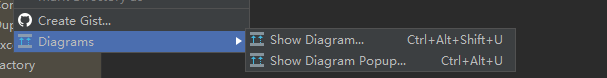

思路以及数据来源公众号《Bin的技术小屋》
## 从头开发分析
Netty启动类,推荐使用IDEA打开
```shell script
EventLoopGroup bossGroup = new NioEventLoopGroup(1);
```
查看类的关系图,使用右键查看类的依赖关系图,

> 从这个依赖图,需要关心带有Event的几个class,那从下往上一个个看。

NioEventLoopGroup 默认会使用父类构造函数创建对象
nThreads的数量,默认会使用cpu个数*2
```shell script
 protected MultithreadEventExecutorGroup(int nThreads, Executor executor,
                                            EventExecutorChooserFactory chooserFactory, Object... args) {
    //线程池 
    if (executor == null) {
               executor = new ThreadPerTaskExecutor(newDefaultThreadFactory());
      }    
    
   children = new EventExecutor[nThreads];    
   //循环创建reactor group中的Reactor
   for (int i = 0; i < nThreads; i ++) {
              boolean success = false;
              try {
                  //方法采用模板模式定义,默认会使用NioEventLoopGroup:newChild
                  children[i] = newChild(executor, args);
                  }
                  success = true;
              } catch (Exception e) {
                  // TODO: Think about if this is a good exception type
                  throw new IllegalStateException("failed to create a child event loop", e);
              } finally {
                  if (!success) {
                      for (int j = 0; j < i; j ++) {
                          children[j].shutdownGracefully();
                      }
  
                      for (int j = 0; j < i; j ++) {
                          EventExecutor e = children[j];
                          try {
                              while (!e.isTerminated()) {
                                  e.awaitTermination(Integer.MAX_VALUE, TimeUnit.SECONDS);
                              }
                          } catch (InterruptedException interrupted) {
                              // Let the caller handle the interruption.
                              Thread.currentThread().interrupt();
                              break;
                          }
                      }
                  }
              }
          }   
      
      //绑定channel到reactor,合理分配连接给不同的reactor
      chooser = chooserFactory.newChooser(children);
      //省略                                          
}
```

> 在Reactor线程启动的时候，Netty会将Reactor线程要做的事情封装成Runnable，丢给exexutor启动。而Reactor线程的核心就是一个死循环不停的轮询IO就绪事件，处理IO事件，执行异步任务

## 创建Reactor
```shell script
children[i] = newChild(executor, args);
```
默认使用NioEventLoopGroup
```shell script
  @Override
    protected EventLoop newChild(Executor executor, Object... args) throws Exception {
        //任务队列
        EventLoopTaskQueueFactory queueFactory = args.length == 4 ? (EventLoopTaskQueueFactory) args[3] : null;
        
        return new NioEventLoop(this, executor, (SelectorProvider) args[0],
            ((SelectStrategyFactory) args[1]).newSelectStrategy(), (RejectedExecutionHandler) args[2], queueFactory);
    }
```
newchild(xxx)方法做了两件事,创建TaskQueue,创建NioEventLoop(监听事件),
```shell script
 NioEventLoop(NioEventLoopGroup parent, Executor executor, SelectorProvider selectorProvider,
                 SelectStrategy strategy, RejectedExecutionHandler rejectedExecutionHandler,
                 EventLoopTaskQueueFactory queueFactory) {
        super(parent, executor, false, newTaskQueue(queueFactory), newTaskQueue(queueFactory),
                rejectedExecutionHandler);
        this.provider = ObjectUtil.checkNotNull(selectorProvider, "selectorProvider");
        this.selectStrategy = ObjectUtil.checkNotNull(strategy, "selectStrategy");
        final SelectorTuple selectorTuple = openSelector();
        this.selector = selectorTuple.selector;
        this.unwrappedSelector = selectorTuple.unwrappedSelector;
    }
```

### openSelector
```shell script
 private SelectorTuple openSelector() {
   final Selector unwrappedSelector;
        try {
            unwrappedSelector = provider.openSelector();
        } catch (IOException e) {
            throw new ChannelException("failed to open a new selector", e);
        }
  //....
}
```
通过前面传入的参数,选择具体协议实现(epoll,select)。
举例说明：当前使用平台为windows，jdk8环境,provider由WindowsSelectorProvider实现。
#### Selector
先了解下JDK NIO中的Selector中这几个字段的含义
```shell script
public abstract class SelectorImpl extends AbstractSelector {
    //就绪队列,监听到的key放到selectionkeys中
    protected Set<SelectionKey> selectedKeys = new HashSet();
    //注册到该Selector上的Channel
    protected HashSet<SelectionKey> keys = new HashSet();
    //所有注册在该Selector上的SelectionKey
    private Set<SelectionKey> publicKeys;
    //所有注册在该Selector上的可读可写IO操作的SelectionKey
    private Set<SelectionKey> publicSelectedKeys;

    protected SelectorImpl(SelectorProvider var1) {
        super(var1);
        if (Util.atBugLevel("1.4")) {
            this.publicKeys = this.keys;
            this.publicSelectedKeys = this.selectedKeys;
        } else {
            this.publicKeys = Collections.unmodifiableSet(this.keys);
            this.publicSelectedKeys = Util.ungrowableSet(this.selectedKeys);
        }
    }
}
```
回到前面的部分,openSelector(),主要是netty对jdk封装的SelectionKey还进行了优化处理,使用SelectedSelectionKeySet,数组替换hashset。

_原文提到,数组能最大限度能利用cpu缓存。可以动动脑子想想为什么？ 老夫后面再开一个篇章_

到这,selector创建结束。

#### Queue
创建空闲任务队列
```shell script
   private static Queue<Runnable> newTaskQueue(
            EventLoopTaskQueueFactory queueFactory) {
        if (queueFactory == null) {
            return newTaskQueue0(DEFAULT_MAX_PENDING_TASKS);
        }
        return queueFactory.newTaskQueue(DEFAULT_MAX_PENDING_TASKS);
    }
```
Queue是MpscQueue,根据注释支持多个生成者,但是只有有一个消费者,天生线程安全
```shell script
    /**
     * Create a new {@link Queue} which is safe to use for multiple producers (different threads) and a single
     * consumer (one thread!).
     * @return A MPSC queue which may be unbounded.
     */
    public static <T> Queue<T> newMpscQueue() {
        return Mpsc.newMpscQueue();
    }
```

SingleThreadEventLoop
Reactor负责执行的异步任务分为三类：

- 普通任务：这是Netty最主要执行的异步任务，存放在普通任务队列taskQueue中。在NioEventLoop构造函数中创建。
- 定时任务： 存放在优先级队列中。后续我们介绍。
- 尾部任务： 存放于尾部任务队列tailTasks中，尾部任务一般不常用，在普通任务执行完后 Reactor线程会执行尾部任务。**使用场景：**比如对Netty 的运行状态做一些统计数据，例如任务循环的耗时、占用物理内存的大小等等都可以向尾部队列添加一个收尾任务完成统计数据的实时更新。

**channel是如何关联reactor**

### DefaultEventExecutorChooserFactory
```shell script
   public EventExecutorChooser newChooser(EventExecutor[] executors) {
        if (isPowerOfTwo(executors.length)) {
            return new PowerOfTwoEventExecutorChooser(executors);
        } else {
            return new GenericEventExecutorChooser(executors);
        }
    }
```
如果长度的2的幂,就选择位运算计算,否则就除余操作

## 向Reactor线程组中所有的Reactor注册terminated回调函数

当Reactor线程组NioEventLoopGroup中所有的Reactor已经创建完毕，Channel到Reactor的绑定策略也创建完毕后，我们就来到了创建NioEventGroup的最后一步。

```shell script
 final FutureListener<Object> terminationListener = new FutureListener<Object>() {
            @Override
            public void operationComplete(Future<Object> future) throws Exception {
                if (terminatedChildren.incrementAndGet() == children.length) {
                    terminationFuture.setSuccess(null);
                }
            }
        };

        for (EventExecutor e: children) {
            e.terminationFuture().addListener(terminationListener);
        }
```
回调函数,做的事情很简单。
记录channel是否全部关闭,如果全部关闭则set status==null;


   


