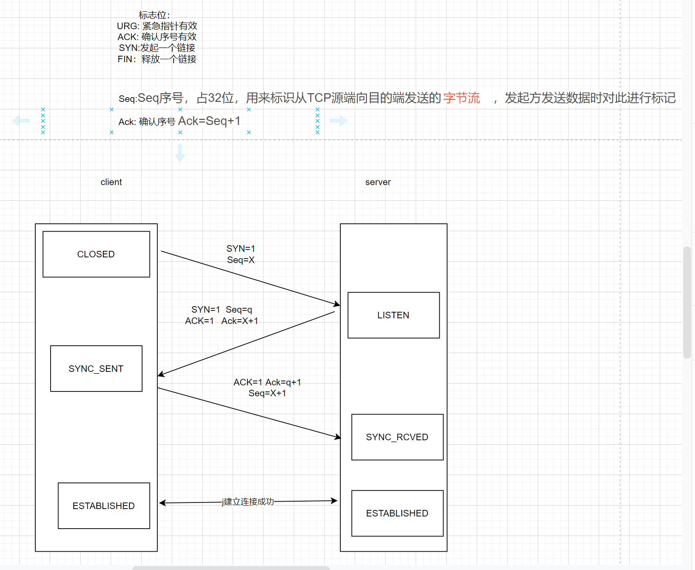
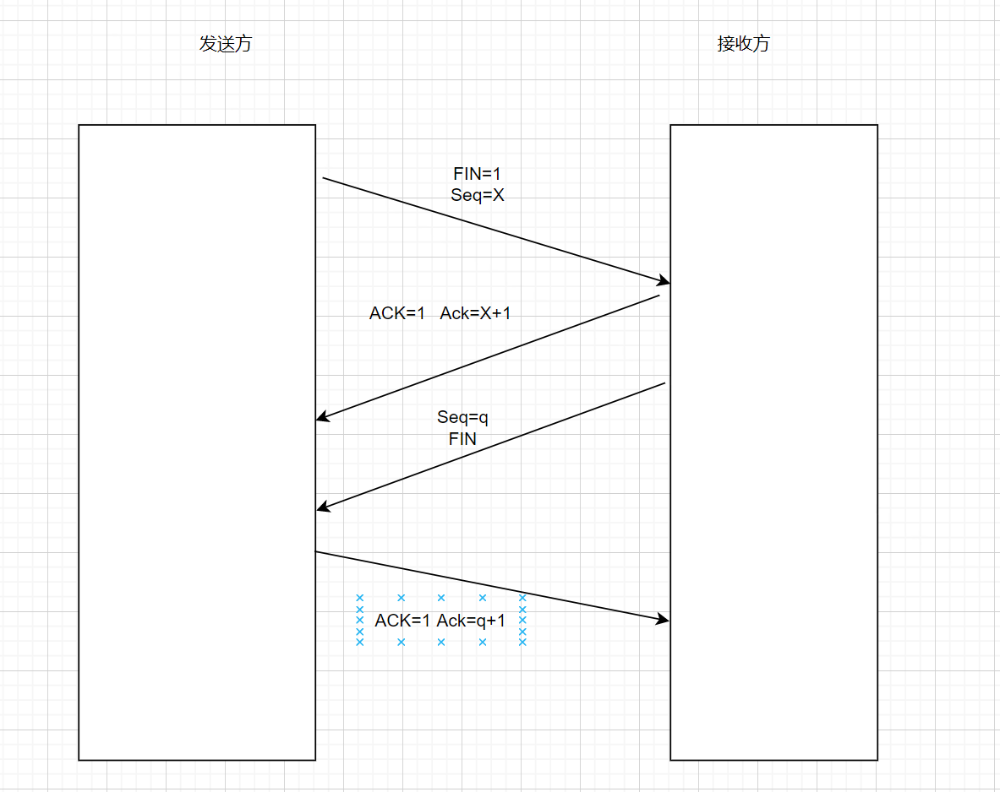

## TCP/IP 
TCP/IP四层协议 网络接口层 网络层 传输层 应用层

|  | UDP | TCP |
| --- | --- | --- |
| 是否连接 | 无连接 | 三次握手,四次挥手 |
| 是否可靠 | 不可靠 | 可靠传输 |
| 连接对象 | 1V1 或者 1VN | 1V1 |
| 传输方式 | 面向报文 | 面向字节流 |
| 首部开销 | 8字节 | 最小20字节 最大60字节 |
| 使用场景 | 直播，视频会议 | 适合可靠的传输场景 |

- TCP 向上层提供面向连接的可靠服务 ，UDP 向上层提供无连接不可靠服务。
- UDP 没有 TCP 传输可靠，但是可以在实时性要求搞的地方有所作为。
- 对数据准确性要求高，速度可以相对较慢的，可以选用TCP。

## TCP 是如何实现数据的可靠性？

一句话：通过校验和、序列号、确认应答、超时重传、连接管理、流量控制、拥塞控制等机制来保证可靠性。

（1） 校验和

> 在数据传输过程中，将发送的数据段都当做一个16位的整数，将这些整数加起来，并且前面的进位不能丢弃，补在最后，然后取反，得到校验和。

> 发送方：在发送数据之前计算校验和，并进行校验和的填充。接收方：收到数据后，对数据以同样的方式进行计算，求出校验和，与发送方进行比较。

（2）序列号

> TCP 传输时将每个字节的数据都进行了编号，这就是序列号。序列号的作用不仅仅是应答作用，有了序列号能够将接收到的数据根据序列号进行排序，并且去掉重复的数据。

（3）确认应答

> TCP 传输过程中，每次接收方接收到数据后，都会对传输方进行确认应答，也就是发送 ACK 报文，这个 ACK 报文中带有对应的确认序列号，告诉发送方，接收了哪些数据，下一次数据从哪里传。

（4）超时重传

> 在进行 TCP 传输时，由于存在确认应答与序列号机制，也就是说发送方发送一部分数据后，都会等待接收方发送的 ACK 报文，并解析 ACK 报文，判断数据是否传输成功。如果发送方发送完数据后，迟迟都没有接收到接收方传来的 ACK 报文，那么就对刚刚发送的数据进行重发。

（5）连接管理

> 就是指三次握手、四次挥手的过程。

（6）流量控制

> 如果发送方的发送速度太快，会导致接收方的接收缓冲区填充满了，这时候继续传输数据，就会造成大量丢包，进而引起丢包重传等等一系列问题。TCP 支持根据接收端的处理能力来决定发送端的发送速度，这就是流量控制机制。

> 具体实现方式：接收端将自己的接收缓冲区大小放入 TCP 首部的『窗口大小』字段中，通过 ACK 通知发送端。

（7）拥塞控制

> TCP 传输过程中一开始就发送大量数据，如果当时网络非常拥堵，可能会造成拥堵加剧。所以 TCP 引入了慢启动机制，在开始发送数据的时候，先发少量的数据探探路。

## TCP三次握手与四次挥手实现过程

### 三次握手

> 详细描述:

(1)client发送 SYN标志位 Seq 给Server端 代表要建立链接

(2)server收到连接申请 回复ACK确认标志,Ack序列号=客户端发送的Seq+1 新的Seq 新的SYN标志位，代表server收到了链接并且同意创建链接

(3)client收到确认链接 再发起二次确认Ack=新的Seq+1 Seq=旧的Seq序列号+1

*为什么需要三次握手?*

前面两次握手链接已经将client和server端连接在一起,只有经过第三次握手确认 才能确保双方都能收到数据

#### 四次挥手

*为什么需要四次挥手呢？*
> 释放链接需要四次是因为TCP连接会存在一个半关闭状态,客户端在发送关闭连接的时候,此时不可以发送数据,但依然能接收数据。

> 需要等到服务器端发送FIN后 ,客户端此时明白可以关闭。所以这里的ACK报文和FIN报文多数情况下都是分开发送的，这也是为什么释放连接时需要交换四次报文了。 

总结一句话:因为TCP连接是全双工通信,需要两边都要发送断开链接以及确认回复断开

*为什么四次挥手后发送端还会等待2个MSL(报文最大生存时间)*
- 第一，为了保证客户端发送的最后一个ACK报文段能够到达服务端。
- 第二，防止已经失效的连接请求报文段出现在本连接中。 

> 客户端在发送完最后一个ACK报文段后，再经过时间2MSL。就可以使本连接持续的时间内所产生的所有报文段都在网络中消失。这样就可以在下一个新的连接中不会出现这种旧的连接请求报文段。

## 在浏览器中输入一个www.baidu.com后执行的全部过程？

> 域名解析 -> 建立TCP连接（三次握手）-> 发起http请求 -> 服务器响应http请求，浏览器得到html代码 -> 浏览器解析html代码，并请求html代码中的资源（如 js、css、图片等）-> 浏览器对页面进行渲染呈献给用户。

