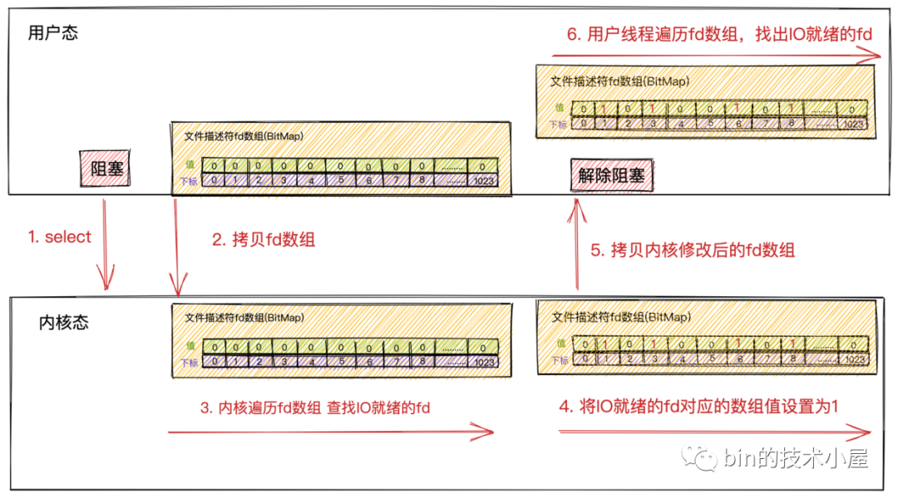

读书笔记：来源公众号《Bin的技术小屋》

## 同步Vs异步,阻塞Vs非阻塞
写了这么多年代码,你真的了解这几个基本概念吗? 
众所周知服务器在读取数据的时候,存在两个阶段,第一个阶段准备数据,第二个阶段拷贝数据。
- 准备阶段：读取数据的数据,会存储在内核中。
- 拷贝阶段：从内核态拷贝到用户态,应用程序才能正常读取到数据。

- 非阻塞
> 阻塞和非阻塞主要的区分是在第一阶段：数据准备阶段

- 阻塞
> 如果这时内核Socket的接收缓冲区没有数据，那么线程就会一直等待，直到Socket接收缓冲区有数据为止。随后将数据从内核空间拷贝到用户空间，系统调用read返回。

- 同步
同步模式在数据准备好后，是由用户线程的内核态来执行第二阶段。所以应用程序会在第二阶段发生阻塞，直到数据从内核空间拷贝到用户空间，系统调用才会返回。
Linux下的 epoll和Mac 下的 kqueue都属于同步 IO。

- 异步
异步模式下是由内核来执行第二阶段的数据拷贝操作，当内核执行完第二阶段，会通知用户线程IO操作已经完成，并将数据回调给用户线程。所以在异步模式下 数据准备阶段和数据拷贝阶段均是由内核来完成，不会对应用程序造成任何阻塞


## 阻塞IO

- 阻塞写：
> 当Socket发送缓冲区空间不够，无法容纳下全部发送数据时，用户线程让出CPU,进入阻塞状态，直到Socket发送缓冲区能够容纳下全部发送数据时，内核唤醒用户线程，执行后续发送流程。

- 阻塞读
> Socket接收缓冲区中无数据，则用户线程让出CPU，进入阻塞状态。当数据到达Socket接收缓冲区后，内核唤醒阻塞状态中的用户线程进入就绪状态，随后经过CPU的调度获取到CPU quota进入运行状态，将内核空间的数据拷贝到用户空间，随后系统调用返回

阻塞IO模型,如果遇到恶意攻击,会大量创建连接,把服务器的连接耗光, 导致服务器资源不够。 比较适合内部系统,并发量不高的情况。

## 非阻塞IO

- 非阻塞写
> vs阻塞写,非阻塞能写多少数据就写多少数据,而且会立刻返回,由应用程序进行轮询写数据
- 非阻塞读
> vs阻塞读,如果当前没有数据,就会立刻返回,进行轮询请求数据,直到获取到数据。

非阻塞IO模型,相对阻塞IO,看上去有很多提升。但是用户线程不断地发起系统调用去轮训Socket接收缓冲区，这就需要用户线程不断地从用户态切换到内核态，内核态切换到用户态。随着并发量的增大，这个上下文切换的开销也是巨大的,会频繁的切换CPU(用户态,内核态)。 性能提升有限


## IO多路复用
相比前面两种见明知意的模型,IO多路复用、多了两个核心概念, 多路、复用。
### 多路
- 多路是什么?
> 以少博大,用几个线程,处理几倍的请求。
### 复用
- 是什么在复用?为什么要复用?
> 复用的是线程,在阻塞模型中,每每有一次新的请求,就会创建一个线程,一个连接。 这里的复用,一个线程处理多个连接。
### 如何实现？
> 将轮询行为交给linux内核,非用户线程自己处理。Linux提供了几种函数实现, select、poll、epoll。
#### select函数
执行流程如下

用户在执行select函数,将需要监听的fd集合交给内核态。内核负责轮询fd,如果有收到数据,会修改fd状态,并且将fd拷贝给用户程序,唤醒用户程序。用户程序循环fd集合状态为1,读取数据。
> 具体使用demo,可以查看redis1.0.9的基本代码,以及API使用。

> 性能开销
虽然select解决了非阻塞IO模型中频繁发起系统调用的问题，但是在整个select工作过程中，我们还是看出了select有些不足的地方。

在发起select系统调用以及返回时，用户线程各发生了一次用户态到内核态以及内核态到用户态的上下文切换开销。发生2次上下文切换

在发起select系统调用以及返回时，用户线程在内核态需要将文件描述符集合从用户空间拷贝到内核空间。以及在内核修改完文件描述符集合后，又要将它从内核空间拷贝到用户空间。发生2次文件描述符集合的拷贝

虽然由原来在用户空间发起轮询优化成了在内核空间发起轮询但select不会告诉用户线程到底是哪些Socket上发生了IO就绪事件，只是对IO就绪的Socket作了标记，用户线程依然要遍历文件描述符集合去查找具体IO就绪的Socket。时间复杂度依然为O(n)。

大部分情况下，网络连接并不总是活跃的，如果select监听了大量的客户端连接，只有少数的连接活跃，然而使用轮询的这种方式会随着连接数的增大，效率会越来越低。

内核会对原始的文件描述符集合进行修改。导致每次在用户空间重新发起select调用时，都需要对文件描述符集合进行重置。

BitMap结构的文件描述符集合，长度为固定的1024,所以只能监听0~1023的文件描述符。

select系统调用 不是线程安全的。

以上select的不足所产生的性能开销都会随着并发量的增大而线性增长。

### poll函数
poll函数对select函数,有所优化,但优化很少可以忽略

### epoll函数
> 老实讲有点绕晕了,对于细节暂时忽略,关注API接口使用。

## Netty
> netty是基于哪种模型使用？
- IO多路复用/Reactor模式

- 配置单Reactor单线程
```shell script
EventLoopGroup eventGroup = new NioEventLoopGroup(1);
ServerBootstrap serverBootstrap = new ServerBootstrap(); 
serverBootstrap.group(eventGroup);
```
- 配置多Reactor线程
```shell script
EventLoopGroup eventGroup = new NioEventLoopGroup();
ServerBootstrap serverBootstrap = new ServerBootstrap(); 
serverBootstrap.group(eventGroup);
```
- 配置主从Reactor多线程
```shell script
EventLoopGroup bossGroup = new NioEventLoopGroup(1); 
EventLoopGroup workerGroup = new NioEventLoopGroup();
ServerBootstrap serverBootstrap = new ServerBootstrap(); 
serverBootstrap.group(bossGroup, workerGroup);
```
实际使用,也会使用主从Reactor模型。


