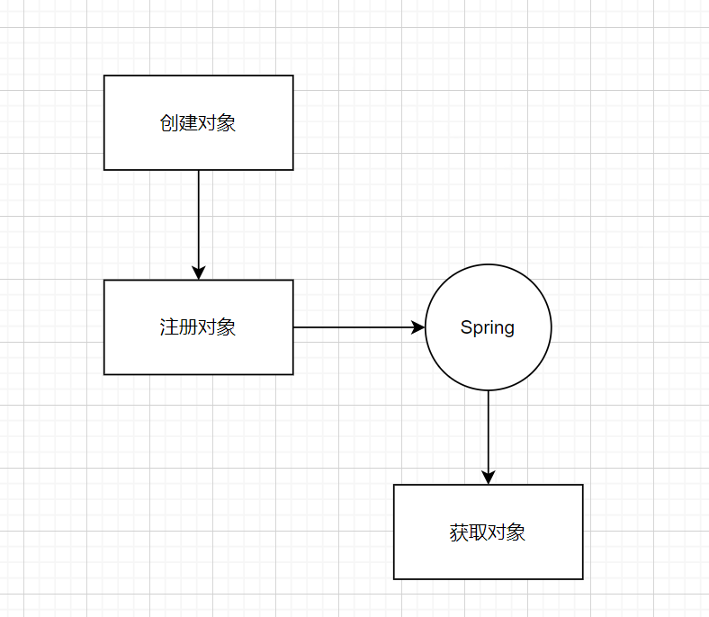
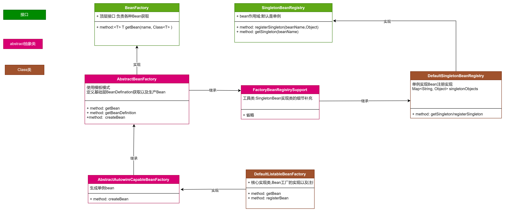

##提出问题
如果是我们自己来设计spring的IOC模块,会从哪些方面考虑？
> IOC全名Inversion of Control控制反转,意味着所有的实例对象统统交给spring管理。

### First
正常创建对象-交给BeanFactory


```java

/**
 * 简介：BeanDefinition描述了bean的实例属性以及构造方法,具体细节可以参考具体的实现类
 * A BeanDefinition describes a bean instance, which has property values,
 * constructor argument values, and further information supplied by
 * concrete implementations.
 * 重点：BeanDefinition是一个基础接口,最主要的目的是允许BeanFactoryPostProcessor修改属性值
 * <p>This is just a minimal interface: The main intention is to allow a
 * {@link BeanFactoryPostProcessor} to introspect and modify property values
 * and other bean metadata.
 */
public interface BeanDefinition extends AttributeAccessor, BeanMetadataElement {
 //省略代码
}
```
### Bean工厂
类的依赖关系图,理清关系脉络。


*从图上可以看到多次使用模板模式进行扩展, 父类定义method的参数跟返回,具体地子类重载实现细节*

#### bean的创建方式
控制反转,意味着由spring控制bean的生成,因此获取的类就是代理类。spring提供了两种方式创建动态代理类

参考demo实现
```java
public class User {
    private Long id;
    private String name;

    public User() {

    }
    public User(Long id, String name) {
        this.id = id;
        this.name = name;
    }
}
```
- jdk反射机制
```java
public static void main(String[] args) {
        User user = new User();
        Class<?> clazz =user.getClass();
        try {
            Constructor<?> constructorToUse = null;
            Constructor[] constructors = clazz.getDeclaredConstructors();
            for(Constructor ctr:constructors){
                if(ctr.getParameterTypes().length==2){
                    constructorToUse=ctr;
                }
            }
            //有参构造函数
            Object[] arg=new Object[]{1L,"XXX"};
            User user1 = (User) clazz.getDeclaredConstructor(constructorToUse.getParameterTypes()).newInstance(arg);
            System.out.println(user1.getId());
            //无参构造函数
//            User user2 = (User) clazz.getDeclaredConstructor().newInstance();
//            System.out.println(user2.getId());
        } catch (Exception e) {
            e.printStackTrace();
        }
    }

```  
- cglib动态代理
```java
public static void main(String[] args){
        User user=new User();
        Class<?> clazz=user.getClass();
        Constructor<?> constructorToUse=null;
        Constructor[]constructors=clazz.getDeclaredConstructors();
        for(Constructor ctr:constructors){
        if(ctr.getParameterTypes().length==2){
        constructorToUse=ctr;
        }
        }
        Object[]arg=new Object[]{1L,"XXX"};
        Enhancer enhancer=new Enhancer();
        enhancer.setSuperclass(user.getClass());
        enhancer.setCallback(new NoOp(){
            @Override
            public int hashCode(){
            return super.hashCode();
            }
        });
        User user1=(User)enhancer.create(constructorToUse.getParameterTypes(),arg);
        System.out.println(user1.getId());
        }
```

#### bean属性填充
代理的Object已创建,但具体的属性还没有填充。

AbstractAutowireCapableBeanFactory->createBean->doGetBean->populateBean->applyPropertyValues

```java
	  // Set our (possibly massaged) deep copy.
		try {
			bw.setPropertyValues(new MutablePropertyValues(deepCopy));
		}
		catch (BeansException ex) {
			throw new BeanCreationException(
					mbd.getResourceDescription(), beanName, "Error setting property values", ex);
		}
```
bean已经创建好,属性已经填充完毕,但如何将bean注册到springFactory还没有看到

#### bean的注册实现

读取资源->装载->注册

XMLBeanDefinitionReader->doLoadBeanDefinitions(加载资源)->DefaultBeanDefinitionDocumentReader->doRegisterBeanDefinitions(注册)
```java
protected void processBeanDefinition(Element ele, BeanDefinitionParserDelegate delegate) {
        BeanDefinitionHolder bdHolder = delegate.parseBeanDefinitionElement(ele);
        if (bdHolder != null) {
        bdHolder = delegate.decorateBeanDefinitionIfRequired(ele, bdHolder);
        try {
          重点// Register the final decorated instance.
        BeanDefinitionReaderUtils.registerBeanDefinition(bdHolder, getReaderContext().getRegistry());
        }
        catch (BeanDefinitionStoreException ex) {
        getReaderContext().error("Failed to register bean definition with name '" +
        bdHolder.getBeanName() + "'", ele, ex);
        }
          注册完成后,发送消息通知
           // Send registration event.
           getReaderContext().fireComponentRegistered(new BeanComponentDefinition(bdHolder));
        }
        }
```
#### bean的扩展机制
当前bean的使用,不具备扩展性。于是spring针对bean的生命周期提供了扩展口


BeanFactoryPostProcessor: 是由 Spring 框架组建提供的容器扩展机制，允许在 Bean 对象注册后但未实例化之前，对 Bean 的定义信息 BeanDefinition 执行修改操作
BeanPostProcessor: BeanPostProcessor 是在 Bean 对象实例化之后修改 Bean 对象，也可以替换 Bean 对象。这部分与AOP有着密切的关系


