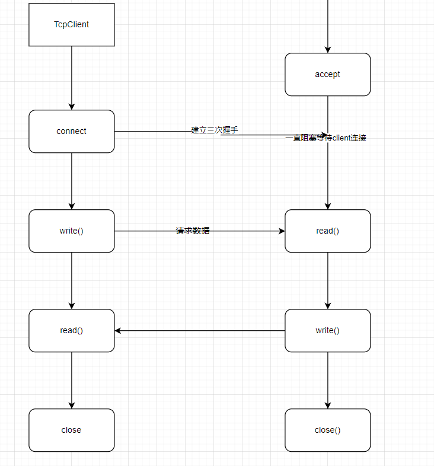

从0开始,就要从redis的远古时期的版本开始仿写,代码简单,新人友好。参考B站UP（楚国刮大风），阅读的redis的源码部分。
源码下载地址(https://download.redis.io/releases/)，redis-server版本为0.091。

参考书籍 《Redis设计与实现》 《Redis开发与运维》

首先需要了解关于redis几个重要特征

- redis-server工作原理,工作流程

- 使用了多少种数据结构

- 事件驱动模式

- 集群实现

## redis的server交互简易流程图

源码从0开始看,同理先从网络编程socket的几个基本概念开始说。

客户端与服务器端的交互简易流程图如下

> 基础版本的redis,所有的操作都是单线程。

- client向server注册的事件为read事件
  > 只需要server有数据返回,client端就可以立即得到数据
- server完成处理后、向client注册write事件
  > client能收到server端的数据
- 通信完client关闭
  > client.close()
- 流程结束

### 学习掌握Nio网络编程

https://itimetraveler.github.io/2018/05/15/%E3%80%90Java%E3%80%91NIO%E7%9A%84%E7%90%86%E8%A7%A3/#%E6%BA%90%E7%A0%81%E5%88%86%E6%9E%90

