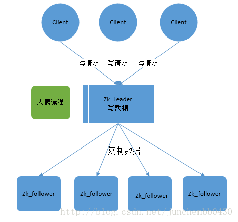

前面在学习Kafka的过程中,发现搭建kafka必然是强依赖zk,因此先理清zk到底在kafka中扮演了什么角色
> zk一个分布式的注册中心(CP架构),从CP这个点看zk维护的是数据的强一致性的关系。换句话说kafka中的leader,follower之间的关系.partion与broker之间的关系
> 包括注册心跳机制等都可以通过zk控制实现。

## zab协议
> 分布式协议的一种实现,关注点在于这个一致性.

zk同步数据

所有的请求会首先到底leader,等到leader将消息同步到follower节点后才会正常返回。 

> 作为一个业务开发人员(伪架构师),了解到这里。再往下研究,我觉得就没得什么必要了。主要是要明白zk能帮助我们解决什么问题？

### 举个🌰
我之前设计的一个监控服务项目的存活情况,大概有10台机器,30台服务(类似于dataX的同步程序)。
以前怎么做:
docker部署+supervisor进程管理+暴露监控接口(采用10s轮询机制)
> 能用吗？ 能。 扩展性有吗? 没有

现在怎么改:
先改部署docker部署+supervisor进程管理直接替换为k8s,这一步不是重点
暴露监控接口(采用10s轮询机制): 改为主动注册到zk上,创建节点并且设置当前的状态信息。此时只需要监控zk的节点变化,就能做到心跳机制。

> 如果了解SpringCloud相关的,想必对这一块很明白,这不是注册服务那一套嘛。事实也的确是如此,我在改进的时候,大量参考代码实现逻辑

