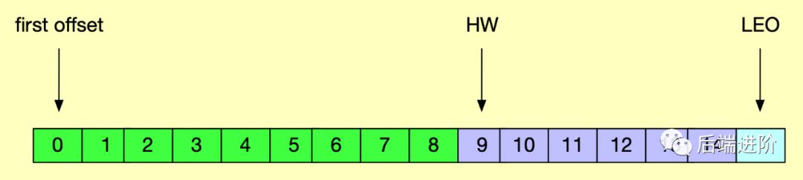

一个逐渐完美的消息队列,早期会存在消息丢失的情况,目前是非常厉害的一个的MQ。
> 不是通识介绍,有任何不懂的请自行google解决问题

[参考文章一](https://mp.weixin.qq.com/s/-uHOUT-AErUnuLjqhvsOow)


## 概念
消息:
Topic: 主题
Partition: 分区
broker: 机器

> 消息需要发送到对应的Topic,每一个topic可能会有多个分区(Partition),这多个分区的消息存放是局部有序. 消息的具体存放会固定到每一个broker机器上

## 消息是如何存放,是否有同步机制,如果某一台broker挂掉会如何？
> 了解一个MQ首先就应该去明白,消息的同步机制。可靠性,是我们在技术选型的一个非常重要的考虑因素。
> 先根据经验想想,如果要保证消息不可丢,参考主从+哨兵的机制。主从结构保证有follower的消息副本备份,哨兵保证当leader挂掉之后,能迅速重新选举一个节点可用

### 那具体的实现逻辑是如何呢?
先介绍几个名词,HW(High Water mark): 高水位标记点 LEO(Log End Offset): 消息最后的提交点.并且HW<=LEO


ISR(In-Sync Replicas): 副本同步列表
> 每一个Partition的消息都存在副本机制,ISR是维护的一个列表,代表当前哪些机器是副本同步

先思考正向的流程
- producer 先从 zookeeper 的 "/brokers/.../state" 节点找到该 partition 的 leader
- producer 将消息发送给该 leader
- leader 将消息写入本地 log
- followers 从 leader pull 消息，写入本地 log 后 leader 发送 ACK
- leader 收到所有 ISR 中的 replica 的 ACK 后，增加 HW（high watermark，最后 commit 的 offset） 并向 producer 发送 ACK

容易出问题的点
follower在同步leader的消息时候,
- leader副本宕机
- follower副本宕机
> 宕机会影响HW的位点的移动,带来的影响也就是消息的丢失。

怎么解决?
> 引入leader epoch。每一个副本下保留一个leader-epoch-checkpoint文件, 文件会记录leader的version 消息的偏移量(0,0)(10,300)(11,500).

就这能解决问题?

核心点在于HW的处理上,咋们来看一下是如何解决的
- leader副本宕机: 副本升级为leader,正常执行修改checkpoint文件
- follower副本宕机: 副本升级为follower, 获取leader副本的lastPoint,leader的版本号。如果刚好对应上,则会重置LEO。但是如果大于了版本号,则会截取日志修改HW


#### ISR(in-sync-replica)
> 每一个分区都维护了消息副本同步的集合,只有在isr中副本,才有可能升级为leader。这里面同步的消息有延迟是很正常,并不一定是实时保持一致

replica.lag.time.max.ms 参数来代替，该参数的意思指的是允许 follower 副本不同步消息的最大时间值，即只要在 replica.lag.time.max.ms 时间内 follower 有同步消息，即认为该 follower 处于 ISR 中，这就很好地避免了在某个瞬间生产者一下子发送大量消息到 leader 副本导致该分区 ISR 频繁收缩与扩张的问题了。


### kafka高吞吐的原因?
>有个基本概念和了解消息同步机制后,想一想kafka日益渐火的原因到底是因为啥? 当然是因为它的足够的快,也就是单机QPS达到百万.

副本机制保障的是消息的高可用,那高吞吐呢?

>高吞吐也就是对I/O的处理,网络的I/O,服务器的I/O(服务器内存,磁盘的I/O).网络的I/0受限于连接方式,消息体压缩协议,带宽等。
>服务器的I/O很容易想到,需要用零拷贝+页缓存。为什么说很容易? 零拷贝能减少数据的拷贝过程,直接落到磁盘上。页缓存可以参考mysql的存储设计,先写page cache,再异步刷新到磁盘上。

#### 服务器i/o
- 顺序读写
> Kafka的message是不断追加到本地磁盘文件末尾的，而不是随机的写入，这使得Kafka写入吞吐量得到了显著提升 
- page cache
> 通过操作系统的page cache,kafka的读写操作基本上是基于内存的，读写速度得到了极大的提升。
- 零拷贝
> 减少与用户空间(堆)打交道,传输数据

#### 网络i/o
- 批处理
> 一支穿云箭,千军万马来相见。仅仅只需要一次i/o,就能传递大量的数据

- 压缩
> 凡是网络协议,一定要考虑压缩。减少带宽,省钱省时。

#### 聊聊发送消息

> 上面提到的发送消息过程中,调用send方法,返回的是一个future对象

```java
public interface Producer<K, V> extends Closeable {

    /**
     * Send the given record asynchronously and return a future which will eventually contain the response information.
     * 
     * @param record The record to send
     * @return A future which will eventually contain the response information
     */
    public Future<RecordMetadata> send(ProducerRecord<K, V> record);
}
```
众所周知,future对象属于aio的一种,是不会立即返回结果。这里的send仅仅只是将数据放到消息缓存池中,真正执行的是Sender类执行run方法


