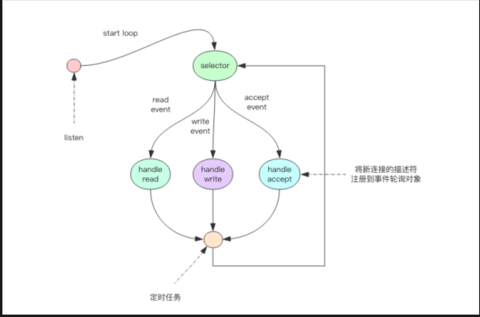
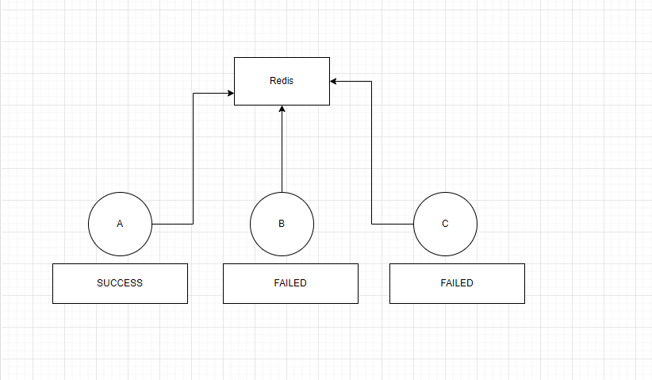

## 思考一下为什么我们会需要分布式锁？
分布式锁见其名,明白这把锁是针对分布式环境。也就是在所谓的当前互联网的三高(高可用,高并发,高流量)下应运而生的一种理念。
### 如果有分布式锁,那我是否还需要jvm锁(synchronized或者Lock)?
分布式锁解决的问题是将锁对象抽象一层,保证每一个服务去竞争同一个资源,但是没有解决服务内部的线程对资源的竞争。
此时用jvm锁 可以解决掉资源的抢占.  保证一个接口只有一个线程能成功抢到

### 分布式锁的两种实现
- 通过轮询的主动方式()
> 常见的有redis的实现,mysql的实现

- 通过事件回调的机制
> 通过zk实现

### 聊聊redis的分布式锁实现机制
#### redis的线程模型

利用select 进行轮询事件监听,这个时候读写的操作的都会被注册到对应的事件处理机制上。最终通过一个定时任务通知事件的回调。
从上面的图可以看到,redis命令是串行化处理,因此可以造成一个客户端抢到锁,而其他的客户端都失败的情况发生

<b>假如A B C三个个客户端去抢锁,A抢到了锁</b>
- 第一种情况 A突然宕机。这个时候如何通知B能够拿到锁呢。
订阅发布+阻塞队列
B/C节点订阅当前key,并加入到一个阻塞队列。按照顺序一次抢占到资源
- 第二种情况 A正常 但是超时了,如何续约呢
CAS机制,renew续约

具体的实现可参考java中的redission框架实现,也就是俗称的开门狗机制,每次续约1/3的超时时间

#### zk实现
CP模型,强一致性保证了我们对锁的资源拥有  
能解决并发的问题 操作都是通过leader进行操作,天然就保证了串行化
实现方式差不多主要是利用两点session跟watch的机制

### redis Vs zk

- redis可能存在丢数据的情况发生,不管redis是在主从(哨兵)集群下,还是cluster模式下。
- redis性能会优于zk,因为redis基于内存的操作 
- redlock 一种分布式锁的实现。用多个主redis(实现复杂度较高一般也不建议使用)
> 举个🌰 A B C抢占锁,锁是由3个redis节点持有,必须同时持有1/2*n+1个锁,才能保证一定能抢占成功资源。

