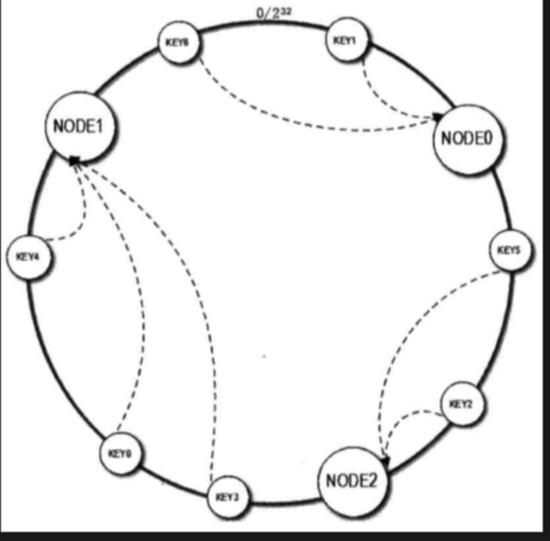
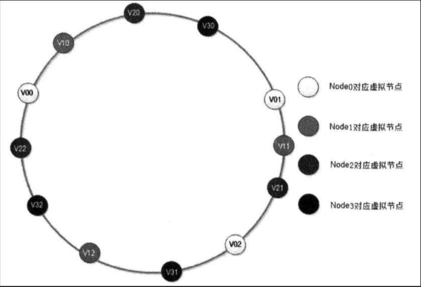

## 了解原理

1. 先构造一个长度为 2^32 的一致性 Hash 环
2. 计算每个缓存服务器的 Hash 值，并记录，这就是它们在 Hash 环上的位置
3. 对于每个key，先根据 key 的 hashcode 得到它在 Hash 环上的位置，然后在 Hash 环上顺时针查找距离这个 Key 的 Hash 值最近的缓存服务器节点

### 数据倾斜
服务器太少的情况下，会造成数据倾斜,所有的数据经过hash计算之后,全部分布到Node0节点,而不是Node1节点与Node2节点

解决方案: 虚拟节点

此时的查找顺序是通过hashcode->虚拟节点->找到真实的服务器节点

### 看看redis是如何应用的？

Redis 在实现自己的分布式集群方案时，采用了基于 P2P 结构的哈希槽算法
1. 使用哈希槽
  a. Redis Cluster 通过分片的方式将整个缓存划分为 16384 个槽，每个缓存节点就相当于 Hash 换上的一个节点，接入集群时，所有实例都将均匀占有这些哈希槽，当需要查询一个 Key 是，首先根据 Key 的 hashcode 对 16384 取余来得到 Key 属于哪个槽，并映射到缓存实例上。
  b. 为了方便描述，将 16384 抽象为 20个哈希槽单位，在增加缓存实例时，假设原来有 4 个节点，分配的哈希槽为 0-4，5-9，10-14，15-19 现在增加一个节点，Redis Cluster 的做法是将之前每台服务器上的一部分哈希槽移动到第四个节点上，更新后的哈希槽分配为 1-4，6-9，11-14，16-19 第四个节点为 0，5，10，15。删除也是同理
2. 去中心化
  a. 每个节点都保存有完整的哈希槽-节点的映射表，也就是说，每个节点都知道自己拥有哪些哈希槽，以及某个确定的哈希槽究竟对应着哪个节点。
  b. 无论向哪个节点发出寻找 Key 的请求，该节点都会通过求余计算该 Key 究竟存在于哪个哈希槽，并将请求转发至该哈希槽所在的节点。

### 代码实现
> 首先需要考虑的问题就是：构造一个长度为 2^32 的整数环，根据节点名称的 Hash 值将服务器节点放置在这个 Hash 环上。
- 排序 + List
算出所有待加入的数据结构的节点名称的 Hash 值放入一个数组中，然后使用排序算法将其从小到大进行排序，最后将排序后的数据放入 List 中。之后，待路由的节点，只需要在 List 中找到第一个 Hash 值比它大的服务器节点就可以了。比如服务器节点的 Hash 值是 [0,2,4,6,8,10]，待路由的节点是 7，则只需要找到第一个比 7 大的整数，也就是 8，就是我们要找的最终需要路由过去的服务器节点。
直接使用 Arrays#sort() 时间复杂度为 O(NLogN)，则总的时间复杂度为：
1. 最好情况，一次找到 O(1) + O(NLogN)
2. 最坏情况，最后一次找到 O(N) + O(NLogN)
则总的时间复杂度为 O(NLogN)
- 遍历 + List
由于排序比较消耗性能，那么可以选择不排序，直接遍历的方式：
1. 服务器节点不排序，其 Hash 值全部放到一个 List 中
2. 等待路由的节点，算出其 Hash 值，由于指明了顺时针，因此遍历 List，比待路由节点 Hash 值大的算出差值并记录，比待路由节点 Hash 值小的忽略
3. 算出所有的差值之后，最小的那个，就是最终需要路由过去的节点
现在算下时间复杂度：
1. 最好的情况是只有一个服务器节点的 Hash 值大于带路由节点的 Hash 值，O(N) + O(1)
2. 最坏的情况是所有服务器节点的 Hash 值都大于待路由节点的 Hash 值，时间复杂度是 O(N) + (N)
则总的时间复杂度为 O(N)
