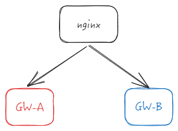

# 网关网络层框架的选择
优点
Netty的优点自不必说,github的开源项目就是最好的证明
缺点
- 开发语言的劣势
也许会觉得Java性能对于做网关而言性能不够用。达不到像golang,rust,c等偏底层语言的性能。
可我们考虑事情一定要明白,对于企业级的业务开发系统而言,Java就是最近30年最合适的,生态最好的

## Netty在网关架构中的功能是什么?

- 第一点:协议转换,例如解析Http请求,将其转换为Rpc请求

- 第二点:连接状态管理,请求次数统计,请求成功率统计等

- 第三点:心跳机制,server与client端之间,掉线通知等等。

- 第四点:无缝更新策略
网关自身的无缝更新能力,例如网关服务是集群,GW-A在更新,只有GW-B提供服务的时候,我们如何切换流量

- 第五点: 熔断,限流,监控策略

- 第六点: 网关路由的动态注册

等等,业务上的需求在此就不在透露,但后续会补充更新一点点。

