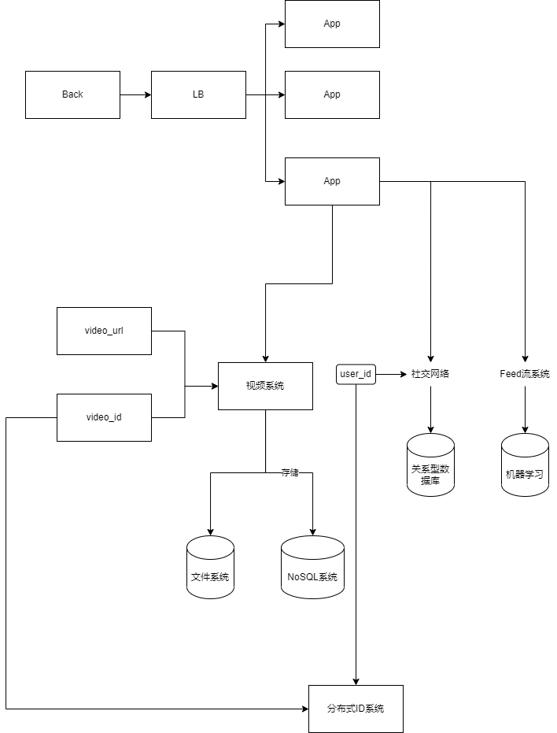

视频来源地址：https://www.youtube.com/watch?v=NHqdG-aZxOk
## 前言
视频中邀请了一位很有深度,广度以及思考的前谷歌架构师去模拟面试,如何设计一个款短视频系统(类似tiktok)。
从视频中,普通人可以学到什么呢? 
- 我们如何思考并且设计属于我们自己的系统
- 面试的时候,如何能最大化的展示自己的知识储备,达到短时间内的一鸣惊人。
- 以下笔记加入了我自己对视频的一些理解,可能不全正确,完整版参考原视频

## 正文内容
### 信息甄别

#### 刻意引导
通过主动问询,确认本次模拟面试的核心,是专注于面试者更擅长的后端的分布式系统设计(大数据下的视频上传、下载、播放，存储),非登录验证,风控,安全等领域。
这样做的目的,能保证面试者能在简单时间内,交出更完美的答卷。

#### 具象化数据
可以与面试官讨论得到以下数据
场景假设
- 10亿 用户
- 150个国家
- 每一年平均上传10亿个视频
- 每个用户平均每天会花1个小时在app上
- 每一个视频1M左右
- 每一个视频时长(10s左右)
细节计算
**熟练学会、并且掌握进制之间的转换**
存储计算
100亿*1M=10PB  ->blob 存储
10PB*1kb(视频元数据)=10TB video of metadata ->NO SQL存储
视频数量计算
10亿/365天=30M/day
30M/100.000秒=300/s 每一秒上传300个视频(峰值可能300*3)

### 抽象设计
必须要有高屋建瓴的设计意识,一开始不要深陷其中的技术细节,天上飞的理论,地上走的实践。
举例说明:
通过上面的计算,我们知道视频的存储需要使用一个可靠的分布式文件系统,应对来自150个国家用户的上传。重点:文件系统选型、分布式协议等等
视频的播放,我们必须要考虑引入CDN技术(内容分发网络),例如：英国上传的视频在印度播放,延时不能>200ms 重点:CDN技术

**我没有开发过分布式文件系统,那我们怎么知道该引入这门技术呢, 一个人平时对技术的学习广度就体现出来了。**

针对视频中提到,再加上自己的理解,画了一个简易的系统设计图

二次确认环节,当我们说到某个点后,必须要确认我们的方向是没有偏离面试官的预期的。

### 细节补充
机器学习的细节实现我们也许并不知道,但是我们必须得提及一件事,为什么我们要考虑在feed流系统中引入机器学习？
#### 理论
- 通过人看视频的习惯,给人打一个标签,例如二次元青年
- 通过视频上传初分类，以及关键字,打上标签,例如海贼王
- 机器学习通过不停对观看视频习惯分析(点赞,投币,转发),推送给对应的用户
#### 举例说明
机器学习可以简化为用户视频推送生成器
针对每一个用户,带有以下标签的原数据
- likeVideoCategory(喜爱的视频类型)
- notLikeVideoCategory(讨厌的视频类型)
- keyword(关键词:emo,e人)

### 自信
条理清晰+自信,阐述所有想表达的内容。
- 内容质量或许有高下之分,但自信才是弥补一切的关键因素。

  

