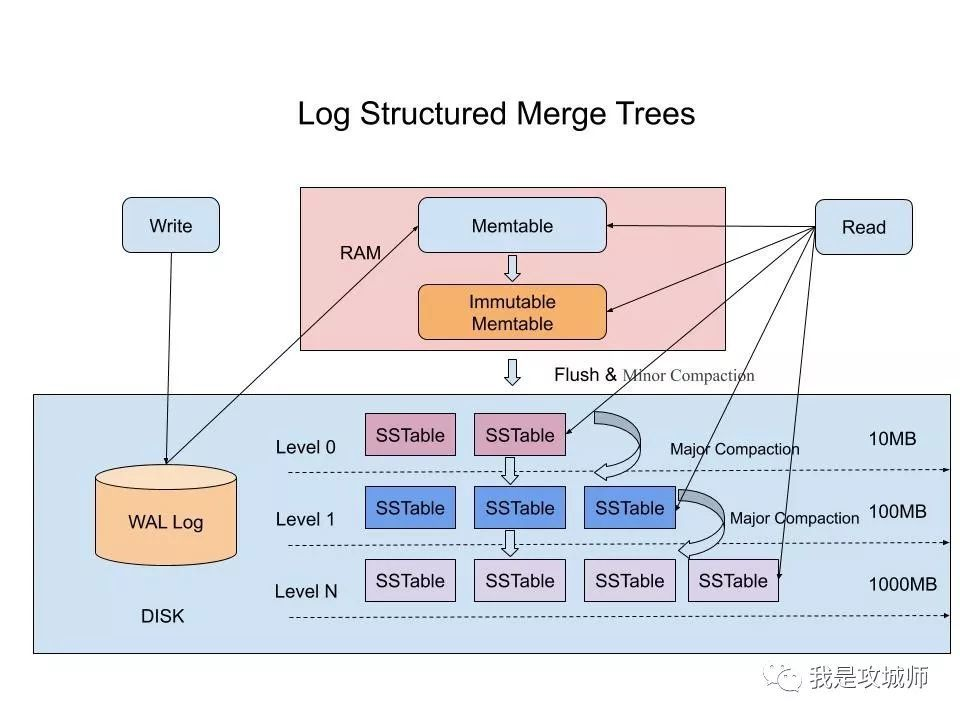

## LSM论文

[https://www.cs.umb.edu/~poneil/lsmtree.pdf](https://www.cs.umb.edu/~poneil/lsmtree.pdf)
[https://web.stanford.edu/~ouster/cgi-bin/papers/lfs.pdf](https://web.stanford.edu/~ouster/cgi-bin/papers/lfs.pdf)

[参考阅读文章](https://dev.to/creativcoder/what-is-a-lsm-tree-3d75)

## 个人总结

LSM的优点已经很明显,相对于B+树的实现,能存储更多的数据,由于写数据的时候是顺序写,速度会明显高于随机写

缺点在于: sstable的合并,合并会对磁盘资源进行抢占,在高并发的情况下、出现大量读等待。
### 存
使用内存结构Memtable存储初始写入数据,当达到存储阈值后Memtable转变为Immutable,Immutable进行落盘(disk 磁盘)。重新创建一个Memtable。

### 读
当收到读请求时，先查询内存的memtable，如果查到则返回。
当在Memtable中没有查到的时候，如果此时有Immemtable正在合并则在此中查找如果查到则返回。
如果仍然没有找到，则进入硬盘中查找，并通过sstable进行分层的遍历查找，找到则返回未找到则返回空，最差的结果就是所有的层都遍历到。

### 写
当写入的时候，首先先写到wal日志中，用以当做故障恢复等用。
当写完WAL之后，会首先写到内存中的Memtable中，数据会存在内存中，并在内存中维护一个排序用于查找。
当Memtable超过一定的大小后，会在内存里面冻结，变成不可变的Memtable，同时为了不阻塞写操作需要新生成一个Memtable继续提供服务。
把内存里面不可变的Memtable给dump到硬盘上的SSTable层中，此步骤也称为Minor Compaction，这里需要注意在L0层的SSTable是没有进行合并的，所以这里的key range在多个SSTable中可能会出现重叠，在层数大于0层之后的SSTable，不存在重叠key。
当每层的磁盘上的SSTable的体积超过一定的大小或者个数，也会周期的进行合并。此步骤也称为Major Compaction，这个阶段会真正的清除掉被标记删除掉的数据以及多版本数据的合并，避免浪费空间，注意由于SSTable都是有序的，我们可以直接采用merge sort进行高效合并，在合并的过程中会导致查询写入的性能下降。

